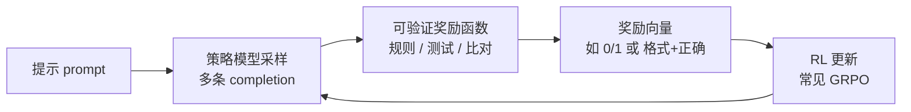

---
tags:
  - data
  - training
aliases:
  - RLVR
  - 可验证奖励强化学习
  - Reinforcement Learning with Verifiable Rewards
prerequisites:
  - "[[llm]]"
  - "[[rlhf]]"
related:
  - "[[rlhf]]"
  - "[[rlhf-bias]]"
  - "[[training-data]]"
stability: mid
layer: model
updated: 2026-05-31
---

# RLVR（可验证奖励强化学习）

> [!tip] 核心本质
> **当一道题的对错可以用规则自动判定时，为什么还要训练一个神经网络来「猜人类喜不喜欢」？**
>
> *因为 [[rlhf|RLHF]] 的奖励来自人类偏好或奖励模型，本质是概率性的代理信号；而在数学、代码等任务上，编译器、单元测试、答案比对能给出客观对错——RLVR 就是把这种**可验证信号**直接当作强化学习的奖励。*
>
> 没有 RLVR，推理类模型仍可在 SFT 上学到「像在做推理」的格式，却缺少持续、廉价、可审计的优化压力去逼近**真正正确**。

---

## 生命周期与演进

**当前定位**：2024–2025 年后训练范式中，与 RLHF 并列的**推理对齐**主路径；DeepSeek-R1、Tülu 3 等开源后训练流水线将其工程化，常与 **GRPO**（Group Relative Policy Optimization）绑定使用（[详见][deepseek-r1]）。

**预期寿命**：在「有标准答案 / 可自动验真」的任务域内，中期内仍是默认选择；开放域对话、价值观对齐仍依赖 RLHF / DPO 等偏好学习。

**近期演进**：从纯规则二元奖励（对/错）扩展到格式奖励、过程奖励、参考链奖励（RLVRR 等）；优化器从 GRPO 演进到 DAPO、Dr. GRPO，解决长度偏置与难度偏置（[详见][dapo]）；研究争议集中在「RLVR 是扩展推理能力还是仅提升采样效率」（[详见][rlvr-theory]）。

**终极威胁**：任务无法形式化验真时 RLVR 不适用；Verifier 本身有漏洞或被模型「钻空子」时，会退化为另一种奖励黑客；更强基础模型 + 测试时扩展（Test-time Scaling）可能部分替代纯 RL 后训练。

---

## 从 RLHF 到 RLVR：奖励从哪来

[[rlhf|RLHF]] 解决的是「什么回答对人类更好」——偏好数据 → 奖励模型 → PPO 优化。这条链路在开放对话上有效，但在**推理密集型**任务上暴露出结构性问题：

**奖励模型是第二套神经网络。** 它会被流畅但错误的答案欺骗，优化过程中还会出现 [[rlhf-bias|奖励偏置与奖励黑客]]。DeepSeek-R1 团队明确选择不在大规模 RL 中使用神经奖励模型，原因就是 reward hacking 与重训成本（[详见][deepseek-r1]）。

**人类标注贵且慢。** 数学题最终答案对错、代码能否通过测试，不需要人逐条打分——规则就能判。

**推理任务有 ground truth。** 当存在可执行的验真程序时，奖励函数可以写成确定性函数 \( r(s, a) \in \{0, 1\} \)（或带少量格式分），而不是学出来的标量偏好。

RLVR（Reinforcement Learning with **Verifiable** Rewards，可验证奖励强化学习）因此不是 RLHF 的简单改名，而是**奖励来源**的根本切换：从「学出来的偏好代理」变为「外部可执行的验真器」。

**表 1：RLHF 与 RLVR 对照**

| 维度 | RLHF | RLVR |
| --- | --- | --- |
| 奖励来源 | 人类偏好 / 奖励模型 | 规则、测试、形式化验证 |
| 典型任务 | 对话、写作、安全对齐 | 数学、代码、逻辑推理 |
| 奖励性质 | 连续、主观、可漂移 | 多为稀疏二元、客观 |
| 常见优化器 | PPO + Critic | GRPO（无 Critic） |
| 主要风险 | 偏好偏置、奉承、长度偏置 | Verifier 漏洞、探索不足、分布外失效 |

---

## 训练循环：采样、验真、更新

RLVR 的控制流比 RLHF 更短——通常**不需要单独训练奖励模型**。

**图 1：RLVR 基本训练循环**

### 采样（Rollout）

对同一 prompt \( q \)，从当前策略 \( \pi_\theta \) 采样一组输出 \( \{o_1, \ldots, o_G\} \)（DeepSeek-R1 使用 GRPO，每组多条 response 做组内相对比较（[详见][deepseek-math]））。推理模型往往配合**长链式思维**（Chain-of-Thought）：模型在 `` 等标签内展开推导，再给出可解析的最终答案。

### 验真（Verification）

验真器是 RLVR 的核心资产，必须**可复现、可审计**。常见形态：

- **数学**：提取 `\boxed{}` 或固定格式中的最终答案，与标准答案做等价判定（符号计算或字符串规范化）。
- **代码**：将生成代码送入编译器 / 沙箱，跑预设单元测试（类似 HumanEval、LiveCodeBench 判题）。
- **格式**：检查是否包含必需标签、是否混用语言等——DeepSeek-R1-Zero 使用 **accuracy reward + format reward** 的组合（[详见][deepseek-r1]）。

奖励通常是稀疏的：全对给 1（或更高），否则 0；也可叠加小权重的格式分，引导模型先学会「可解析的输出结构」。

### 策略更新（Policy Optimization）

RLVR 几乎总是与 **GRPO** 一起出现：去掉与策略同规模的 **Critic / Value 模型**，在同一 prompt 的 \( G \) 条样本内对奖励做归一化，用组内相对优势 \( A_i \) 更新策略——显存与工程复杂度显著低于经典 PPO（[详见][deepseek-math]）。

后续变体 **DAPO** 在规模化训练中引入解耦 clip、动态采样、token 级损失聚合，并常在可验证奖励场景下**去掉 KL 惩罚**（\( \beta = 0 \)），因为规则奖励不随分布漂移而失真（[详见][dapo]）。

---

## 典型流水线：以 DeepSeek-R1 为例

DeepSeek-R1 是目前 RLVR 最完整的公开案例，展示「纯 RL 能涌现推理行为」与「多阶段混合训练」两种模式（[详见][deepseek-r1]）。

### DeepSeek-R1-Zero：无 SFT 的纯 RL

- 基座：DeepSeek-V3-Base，**不做**冷启动 SFT。
- 算法：GRPO + 规则奖励（accuracy + format）。
- 现象：训练中出现自验证、反思、长 CoT 等**自发行为**；AIME 2024 pass@1 从 15.6% 升至 71.0%。
- 含义：在可验证域内，RL  alone 足以激励模型探索推理策略，而不必先喂大量人工 CoT 示范。

### DeepSeek-R1：冷启动 + 推理 RL + 拒绝采样 SFT + 全场景 RL

完整 R1 在四阶段串联多种信号：

1. **冷启动 SFT**：少量高质量长 CoT 数据，避免 RL 早期不稳定。
2. **推理向 RLVR**：数学、代码、逻辑等可规则验真任务，继续 GRPO + 规则奖励（含语言一致性奖励）。
3. **拒绝采样 SFT**：从 RL checkpoint 采样，只保留验真通过的轨迹，扩充约 600k 推理样本；非规则域可用生成式 RM 辅助筛选。
4. **二次 RL**：推理任务仍用规则奖励；通用 helpful/harmless 场景回到**偏好奖励模型**——说明 RLVR 与 RLHF 在**同一模型**里按任务域分工，而非互斥。

这条流水线回答了一个常见误解：RLVR **不是**「完全不要 SFT」，而是「在能验真的阶段用验真奖励驱动 RL；在不能验真的阶段仍需要偏好对齐」。

---

## 边界：适用域、能力与风险

### 什么时候适合 RLVR

任务满足 **VERifier-friendly** 条件时收益最大：

- 存在**客观正确性**标准（唯一答案、测试用例、形式化规格）。
- 输出可被**程序化解析**（答案框、代码块、JSON schema）。
- 验真成本低于人工偏好标注，且结果稳定。

数学竞赛题、LeetCode 风格代码、部分逻辑谜题是典型 sweet spot。

### 什么时候不适合

- **开放创作**（散文风格、主观创意）：没有 ground truth，规则奖励会退化为启发式打分，不如 RLHF/DPO。
- **事实密集型但无验真库**：模型需要世界知识，RLVR 不能注入新事实，只能强化「已有能力上的正确用法」。
- **安全与价值观**：有害性、偏见通常无法单元测试，仍需偏好或宪法式对齐。

### 主要风险

**Verifier 漏洞即新的奖励黑客。** 若格式分过高、测试用例不全、或答案判定过宽，模型会优化「骗过验真器」而非「真正理解」——与 RLHF 的 Goodhart 问题同构，只是 exploit 对象变成了规则（[详见][rlhf-bias]）。

**稀疏奖励与探索。** 全 0 奖励的组对梯度贡献弱；需要足够大的 \( G \)、合适的基础模型能力，或课程式难度分布。

**能力争议。** 有研究认为 RLVR 主要提升 pass@1 与采样效率，未必扩展模型本不可达的推理边界（[详见][r1-zero-critique]）；工程上仍值得做，但评估应看**分布外**与**反例集**，不能只看 benchmark 涨幅。

---

## 实践要点

若要在自有任务上尝试 RLVR，最小闭环通常是：

1. **定义验真器**：先写死 Python 函数 `reward(prompt, completion) -> float`，保证可单测、可复现。
2. **准备 prompt 集**：高难、可判题、与线上目标一致；避免泄漏到 benchmark 的训练集。
3. **选基座与算法**：推理向优先选已有 CoT 潜质的 instruct/base 模型；优化器从 GRPO（如 Hugging Face TRL）起步，规模化再考虑 DAPO 实现（[详见][open-r1]）。
4. **监控**：组内奖励均值/方差、平均生成长度、格式违规率、验真器异常样本——与 RLHF 一样，**看失败 rollout** 比只看 loss 更重要。
5. **与 SFT / RLHF 衔接**：冷启动 SFT 稳态；开放域阶段接 DPO 或 RM——不要指望一条规则奖励对齐整个产品。

---

## 进一步阅读

- [DeepSeek-R1 技术报告（Guo et al., 2025）][deepseek-r1] — RLVR 工程标杆：R1-Zero 纯 RL、规则奖励设计、四阶段流水线
- [DeepSeekMath / GRPO（Shao et al., 2024）][deepseek-math] — GRPO 原始论文，组相对优势与无 Critic 训练
- [DAPO（ByteDance Seed, 2025）][dapo] — 大规模 RLVR 训练系统：clip、动态采样、KL 取舍
- [RLVR 理论：GRPO 与成功概率放大（Zhang et al., 2025）][rlvr-theory] — 二元可验证奖励下 GRPO 的动力学与固定点分析
- [Understanding R1-Zero-Like Training（Liu et al., 2025）][r1-zero-critique] — 对「纯 RL 涌现推理」的批判性视角，评估 RLVR 边界必读
- [Tülu 3 后训练报告（Lambert et al., 2024）][tulu3] — 开源 post-training 全景，含 RLVR 在混合流水线中的位置
- [Awesome RLVR 论文与代码索引（OpenDILab）][awesome-rlvr] — 持续更新的 RLVR 综述、仓库与论文列表
- [Open R1（Hugging Face）][open-r1] — 复现 DeepSeek-R1 风格 GRPO + 可验证奖励的开源项目
- [[rlhf|RLHF]] — 理解偏好对齐与 RLVR 的分工
- [[rlhf-bias|RLHF 偏置]] — 奖励黑客框架同样适用于规则奖励设计

[deepseek-r1]: https://arxiv.org/abs/2501.12948
[deepseek-math]: https://arxiv.org/abs/2402.03300
[dapo]: https://arxiv.org/abs/2503.14476
[rlvr-theory]: https://arxiv.org/abs/2503.06639
[r1-zero-critique]: https://arxiv.org/abs/2503.20783
[tulu3]: https://arxiv.org/abs/2411.15124
[awesome-rlvr]: https://github.com/opendilab/awesome-RLVR
[open-r1]: https://github.com/huggingface/open-r1
