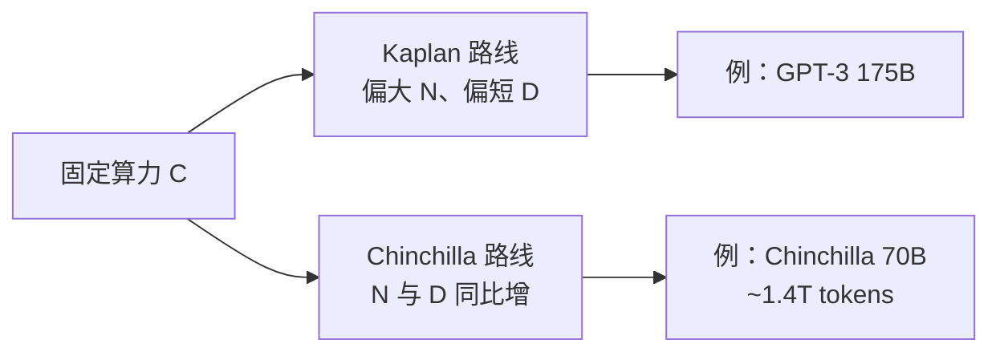

---
tags:
  - principle
  - training
aliases:
  - Scaling Laws
  - 缩放法则
  - 尺度律
  - Chinchilla 定律
prerequisites:
  - "[[llm]]"
  - "[[token-prediction]]"
related:
  - "[[training-data]]"
  - "[[tokenization]]"
  - "[[transformer]]"
  - "[[llm]]"
  - "[[emergence]]"
stability: long
layer: model
updated: 2026-06-14
---

# 缩放法则（Scaling Laws）

> [!tip] 核心本质
> 缩放法则（Scaling Laws）描述：在足够大的范围内，语言模型的预训练损失（Loss）与参数量、训练 token 数、训练算力之间近似服从**幂律**——在对数坐标下呈平滑直线。它回答「多花钱、多加数据、加大模型，性能会不会系统性变好」；若没有这层经验规律，大模型训练只能盲目堆规模，无法分配算力预算。

适合已读 [[llm]] 与 [[token-prediction]]、要理解「为何要大模型、为何要海量数据、Chinchilla 为何改写了训练配方」的读者。读完 [[#3 算力预算：Kaplan 与 Chinchilla|§3]] 能解释 GPT-3 与 Chinchilla/Llama 路线差异；[[#5 能力涌现与争议|§5]] 说明 Agent 选型时如何把「规模」与「指标突变」分开看。

*检索说明：Kaplan et al. (2020) [arXiv:2001.08361](https://arxiv.org/abs/2001.08361)；Hoffmann et al. / Chinchilla (2022) [arXiv:2203.15556](https://arxiv.org/abs/2203.15556)；涌现 [Wei et al. 2022](https://arxiv.org/abs/2206.07682)、争议 [Schaeffer et al. 2023](https://arxiv.org/abs/2304.15004)（观测 2026-06-14）。*

## 生命周期与演进

**当前定位**：大语言模型（LLM）预训练的核心经验定律；工业界用其做算力分配、模型尺寸与数据量配比的前瞻（在固定 FLOPs 下如何分 N 与 D）。

**预期寿命**：长期有效于「同架构、同数据分布、同训练 recipe」范围内的 loss 外推；精确指数随 tokenizer、数据混合与架构（MoE 等）漂移，需周期性重标定。

**近期演进**：Chinchilla 后主流开源模型（Llama 等）普遍**加大训练 token**；前沿模型为推理经济性会**超过**算力最优点继续训（更大 D、相对小 N）；推理时扩展（test-time compute）部分解耦「能力 ↔ 参数量」。

**终极威胁**：数据与算力边际收益递减、合成数据污染标度关系；新架构若打破 Transformer 假设，旧幂律需重测。涌现是否「真突变」仍属评估方法论争议，非 scaling 本身失效。

## 1 三个旋钮与一条曲线

预训练在优化 [[token-prediction|下一 token 预测]] 的交叉熵损失。缩放法则关心三个可独立调节的量：

**表 1 — 缩放法则的三要素**

| 符号 | 含义 | 工程上怎么加 |
| --- | --- | --- |
| N | 参数量（非嵌入层为主） | 更宽、更深、更多专家（MoE） |
| D | 训练 token 数 | 更长训练、更大数据混合 |
| C | 训练算力（FLOPs） | 更多 GPU·秒；与 N、D 通过 batch、步数耦合 |

在广泛实测范围内，测试损失 L 随 N、D 或 C 增加而**平滑**下降，在对数-对数图上接近直线——即幂律：规模翻 k 倍，损失按固定比例下降，而非很快撞墙。这意味着：在资源允许时，**按比例**加大模型与数据，性能往往可预测地改善（以 Loss 或下游 perplexity 衡量）。

这与 [[training-data]] 的关系：数据量 D 是缩放的一维，不是「越大越好」的无条件结论——要与 N、C 配比（见 [[#3 算力预算：Kaplan 与 Chinchilla|§3]]）。

## 2 幂律意味着什么

从设计角度，缩放法则给出三条实用推论：

1. **可外推（有限范围内）**：在同一模型族、相近 recipe 下，用小模型测得的 loss 趋势可部分预测更大模型的 loss——降低「训完才知道」的风险。
2. **算力分配问题**：固定预算 C 时，N 与 D 此消彼长；不存在「只加参数不加数据」的长期最优。
3. **样本效率随 N 变化**：Kaplan 等指出更大模型在相同样本量下 loss 更低——但 Chinchilla 强调许多已发布大模型相对其尺寸**训得不够久**。

缩放法则描述的是**预训练损失与规模**的关系，不直接保证某一 downstream 基准线性变好；下游还受对齐（[[rlhf]]）、提示与 Agent 架构影响。

## 3 算力预算：Kaplan 与 Chinchilla

### 3.1 Kaplan et al.（2020）

[Scaling Laws for Neural Language Models](https://arxiv.org/abs/2001.08361) 系统测量了 Transformer 语言模型的幂律，并讨论**固定算力下如何分配 N 与 D**。其结论之一：在当时的拟合与实验设定下，增加算力时**参数量应比数据量增长更快**——倾向「相对大模型 + 相对少 token 早停」。GPT-3（约 175B 参数、约 300B token）可视为这一思路下的标志性发布。

### 3.2 Chinchilla 定律（2022）

DeepMind 的 [Training Compute-Optimal Large Language Models](https://arxiv.org/abs/2203.15556)（Chinchilla）在更大规模的模型×token 网格上重估，认为当时许多模型**显著欠训练**。在固定 FLOPs 下，**N 与 D 应大致同比扩展**；算力最优附近经验比值约为 **20 tokens / 参数**（量级参考，随细节浮动）。

| 对比 | GPT-3（量级） | Chinchilla-70B（论文） |
| --- | --- | --- |
| 参数量 N | ~175B | ~70B |
| 训练 token D | ~300B（约 1–2 token/参数） | ~1.4T（约 20 token/参数） |
| 相对关系 | 大而短训 | 较小但长训 |

论文报告：在相近训练算力下，**70B + 约 4× 数据** 的配置在多项评测上超过 175B 的 GPT-3——纠正「参数越大越好、数据 300B 够用」的片面印象，强调**数据效率与训练长度**。

### 3.3 对后续开源路线的影响

Llama 等模型普遍采用「相对小一些的 N + 明显更多的 D」——与 Chinchilla 精神一致。工业界也常**故意超过**算力最优点继续训练：推理部署时小模型更便宜，愿意用额外预训练换更低 loss。选型时须区分：

- **算力最优**（给定 C，验证 loss 最低怎么配 N、D）
- **推理最优**（给定延迟/显存，哪个 checkpoint 最好用）

## 4 与 Agent / 产品选型的关系

缩放法则主要指导**预训练与基座选型**，不替代 [[agent]] 里的 Runtime 设计：

| 问题 | 缩放法则能回答 | 不能回答 |
| --- | --- | --- |
| 同样预算训基座，N/D 怎么配 | 是（Chinchilla 区） | — |
| 7B vs 70B 做工具调用谁更稳 | 部分（规模↑通常降 loss） | 具体 benchmark、对齐质量 |
| 是否必须用千亿模型做 Agent | 否；规模↑有帮助但非唯一杠杆 | 小模型 + 检索 + 规划仍可够用 |

对智能体开发者：更大基座往往带来更好的指令遵循、少样本与长上下文利用，但**边际成本**（延迟、费用、显存）陡峭；应结合任务用评测验证，而非仅看参数量。

## 5 能力涌现与争议

### 5.1 「涌现」指什么

[Wei et al. (2022)](https://arxiv.org/abs/2206.07682) 将 **能力涌现（Emergent Abilities）** 定义为：在小模型上不存在或极弱、在大模型上突然出现的下游能力——如少样本提示、链式思考（Chain-of-Thought）、复杂指令遵循、多步推理、代码生成等。这与 [[llm]]、[[token-prediction]]、专文 [[emergence]] 中的表述一致：规模跨过阈值后，某些任务表现**看似**从「不会做」跳到「会做」。

### 5.2 争议：是相变还是度量 artifact

[Schaeffer et al. (2023)](https://arxiv.org/abs/2304.15004) 认为，许多「突变」来自**评估指标**（如 exact match、多选题对错）对 per-token 误差的非线性变换，而非模型行为本质上的阶跃；换连续指标（如 Brier score、编辑距离）时，曲线往往更平滑。小模型因测试样本少，也可能被低估。

**诚实边界**：

- 规模增大确实系统性降低 loss、并常改善复杂任务——缩放法则与工程经验支持这一点。
- 「某一 benchmark 上垂直上升的涌现曲线」不宜无条件等同于「智能相变」；读论文与产品宣传时需看**指标与样本量**。
- 对 Agent：大模型通常是复杂规划与 tool 调用的**实用前提之一**，但不是「超过某 B 参数必涌现自主性」的硬阈值。

## 6 常见误区

- **缩放法则 = 下游任务必然线性变好**：它主要约束 pretrain loss；RLHF、RAG、工具层另论。
- **参数越多越好**：固定算力下欠训练的大模型可输给更小、训足的模型（Chinchilla）。
- **涌现 = 科学定论的相变**：存在活跃争议；工程上「大规模更好用」与「突变叙事」应分开。
- **忽略推理成本**：训练最优 ≠ 部署最优；MoE、蒸馏、小模型 + 强对齐是并行路线。

## 要点收束

- 缩放法则：Loss 对 N、D、C 的幂律关系，支持在广泛范围内**可预测地**改善预训练质量。
- Kaplan（2020）偏「大模型 + 相对少数据」；Chinchilla（2022）修正为算力最优时 **N 与 D 同步放大**，约 **20 tokens/参数** 量级。
- Llama 类模型体现「多训数据、控制参数量」；前沿也常为推理经济性**过度训练**。
- 能力涌现描述规模与复杂任务的关系；Schaeffer 等提醒警惕**非线性指标**造成的突变假象。
- Agent 选型：规模重要，须与对齐、工具、检索和评测一并权衡。

## 进一步阅读

### 库内关联

- [[llm]] — 预训练目标与能力边界
- [[token-prediction]] — 损失函数与 Emergence 表述
- [[emergence]] — 涌现专文：三种说法、度量争议与工程含义
- [[training-data]] — 数据量与质量如何定义能力上限
- [[transformer]] — 被缩放的主要架构

### 外部参考

- [Kaplan et al., Scaling Laws for Neural Language Models (2020)](https://arxiv.org/abs/2001.08361) — 幂律与早期算力分配
- [Hoffmann et al., Training Compute-Optimal LMs / Chinchilla (2022)](https://arxiv.org/abs/2203.15556) — 20 tokens/参数与 70B 对 GPT-3
- [Wei et al., Emergent Abilities of LLMs (2022)](https://arxiv.org/abs/2206.07682) — 涌现能力定义与案例
- [Schaeffer et al., Are Emergent Abilities a Mirage? (2023)](https://arxiv.org/abs/2304.15004) — 指标选择与「突变」再解释
- [GPT-3 (Brown et al., 2020)](https://arxiv.org/abs/2005.14165) — 规模与 few-shot 的里程碑发布
