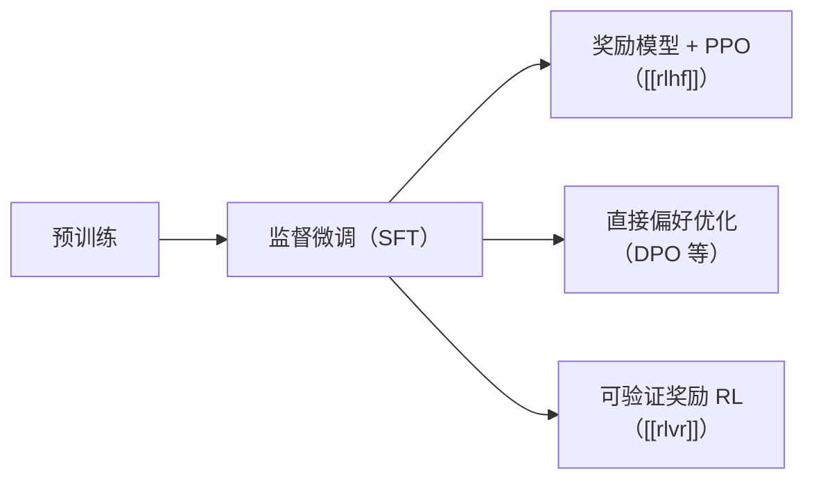

---
tags:
  - data
  - training
aliases:
  - SFT
  - 监督微调
  - Supervised Fine-tuning
  - 指令微调
  - Instruction Tuning
prerequisites:
  - "[[llm]]"
  - "[[token-prediction]]"
related:
  - "[[llm]]"
  - "[[training-data]]"
  - "[[rlhf]]"
  - "[[rlvr]]"
  - "[[tokenization]]"
stability: long
layer: model
updated: 2026-06-15
---

# 监督微调（SFT）

> [!tip] 核心本质
> 监督微调（Supervised Fine-tuning，SFT）用「指令 → 优质回答」示范，在预训练基座上继续做下一词元预测——但只在**回答部分**算损失，把模型从「续写互联网文本」改成「按指令产出目标回答」。若没有这一步，[[rlhf|人类反馈强化学习]] 与 [[rlvr|可验证奖励强化学习]] 缺少可对话、可服从的初始策略，对齐阶段会在格式混乱的分布上浪费算力。

适合已读 [[llm]] 与 [[token-prediction]]、要理解「助手能力从哪来」以及「为何 SFT 之后往往还要对齐」的读者。读完 [[#2 机制：同一损失，不同掩码|§2]] 能复述损失如何只作用在回答上；[[#4 在后训练栈中的位置|§4]] 说明与偏好优化、可验证强化学习的分工；[[#5 边界与常见误区|§5]] 收束数据与过拟合风险。

*检索说明：InstructGPT 流程与 SFT 细节对照 [Ouyang et al., 2022](https://arxiv.org/abs/2203.02155)；指令微调谱系见 [Wei et al., FLAN, 2022](https://arxiv.org/abs/2109.01652)；回答区 loss 掩码见 [Hugging Face TRL SFT Trainer](https://huggingface.co/docs/trl/en/sft_trainer)（观测 2026-06-15）。*

## 生命周期与演进

**当前定位**：大模型后训练的**默认第一站**——预训练基座 → 监督微调 →（可选）[[rlhf]] / 直接偏好优化（DPO）/ [[rlvr]]。工业界大量「指令模型」「Instruct 版」止步于监督微调或在其上叠参数高效微调（PEFT）；对齐是否继续取决于产品与安全要求。

**预期寿命**：「用示范把行为拉到可用区间」长期存在；纯监督微调单独作为最终产品的占比随对齐与推理强化学习上升而下降。

**近期演进**：数据从万级人工示范扩展到百万级合成与多任务混合（FLAN 系、开源指令集）；训练侧 `completion_only_loss`、对话模板 `assistant_only_loss` 成为工程默认；领域与工具调用走专用监督微调（如 tool-use SFT，见 `map` 规划节点 `tool-use-sft`）。

**终极威胁**：更强基座 + 长上下文 in-context 示范可能缩小「必须全参微调」的场景；开放域「什么是好答案」无法仅靠示范穷举，偏好或验真信号仍不可替代。

## 1 预训练之后缺什么

预训练模型是极强的**文本补全机**：给半句话能接出合理下文，但用户要的是「问一句、答一句」的助手行为。常见缺口有三类：

| 缺口 | 表现 | 监督微调补什么 |
| --- | --- | --- |
| **格式** | 续写教程而非直接作答 | 对话模板、角色标记、停答位置 |
| **服从** | 忽略约束（长度、语言、格式） | 示范里体现约束如何被遵守 |
| **任务分布** | 预训练语料混杂，非统一指令空间 | 把目标场景的「问→答」压进参数 |

监督微调不发明新架构，仍用 [[token-prediction|下一词元预测]]；变的是**训练样本形态**与**哪些 token 参与梯度**。

## 2 机制：同一损失，不同掩码

### 2.1 训练目标

每条样本可写成：提示（用户指令、系统设定）+ 完成（模型应生成的回答）。对整段序列做自回归语言建模，但计算交叉熵时，**提示部分的 label 置为忽略索引**（常见为 `-100`），梯度只更新「答对示范回答」所需的预测。

这与预训练的唯一实质差别是：**监督信号从「整段文本都合理」收窄为「在给定提示下，这段回答合理」**。

### 2.2 对话格式与工程默认

多轮对话需固定 **chat template**（特殊 token 分隔 system / user / assistant）。框架侧（如 TRL `SFTTrainer`）提供：

- **`completion_only_loss`**：prompt-completion 字段边界清晰时，只在 completion 上算 loss（当前更稳健的默认路径）。
- **`assistant_only_loss`**：多轮对话中只在 assistant 轮次算 loss，依赖模板支持 `` 掩码。

**图 1 — 监督微调数据流**

## 3 数据从哪来：两条主流谱系

### 3.1 人工示范：InstructGPT 范式

[InstructGPT][instructgpt] 用标注员对真实用户式提示书写**理想回答**（约 1.3 万条量级），直接微调 GPT-3。模型学会模仿标注群体的写作风格与服从度——这是后来 ChatGPT 类产品的经典起点。

论文中一个反直觉细节：验证集 loss 在约 1 个 epoch 后可能过拟合，但**更多 epoch 仍可能提升奖励模型分数与人类偏好**——说明「验证 loss」不是监督微调选型的唯一标尺，任务相关评测更重要。

### 3.2 多任务指令：FLAN / T0

另一条路线把大量 NLP 任务改写成自然语言指令（[FLAN][flan] 在 60+ 数据集、上千模板混合上微调），强调**零样本泛化到未见任务类型**。[T0][t0] 等工作证明「多任务 prompted 微调」可在更小模型上逼近大模型零样本表现。

与 InstructGPT 的差异在于：FLAN 系更偏**任务覆盖与泛化**，InstructGPT 系更偏**真实对话分布与后续偏好对齐**；实践中两者常混合——开源指令集往往同时含百科问答、推理、代码与多轮对话。

**表 1 — 监督微调数据取向（简化）**

| 取向 | 代表 | 数据特点 | 擅长 |
| --- | --- | --- | --- |
| **对话示范** | InstructGPT | 真人写理想回答，规模相对小 | 助手语气、服从、对齐前形态 |
| **任务指令混合** | FLAN、Alpaca 系 | 多任务模板、可合成扩展 | 广度、零样本任务迁移 |
| **领域 / 工具** | 医疗、代码、function calling | 垂直示范或轨迹 | 专用格式与 API 调用 |

数据治理（去重、毒性、事实性）见 [[training-data]]；分词与长度截断见 [[tokenization]]。

## 4 在后训练栈中的位置

监督微调通常插在**预训练与对齐之间**，并常作为对齐的**初始化与锚点**：

- **[[rlhf]]**：监督微调策略生成候选 → 人类排序训奖励模型 → 近端策略优化（PPO）时，监督微调模型常作**参考策略**，KL 散度约束防止漂离示范分布太远。
- **DPO / ORPO**：跳过显式奖励模型，但仍多在监督微调权重上继续优化偏好。
- **[[rlvr]]**：数学、代码等可验真域，监督微调先学「推理格式」，再用规则奖励强化；DeepSeek-R1 等管线即「冷启动监督微调 + 强化学习」。

监督微调单独结束时，你得到的是**示范的加权平均**——流畅、像助手，但对「哪个更好」没有系统优化，也未见过的偏好组合上可能失灵。

## 5 边界与常见误区

### 5.1 监督微调解决不了什么

- **开放域偏好**：「更有帮助 vs 更谨慎」需要比较信号，见 [[rlhf]] 或 DPO。
- **事实正确性**：示范错了，模型会学错；不替代 [[rag]] 或工具检索。
- **长尾与对抗**：示范未覆盖的输入，行为不可控；需评测与对齐补洞。

### 5.2 常见误区

| 误区 | 实际情况 |
| --- | --- |
| 监督微调 = 对齐 | 对齐特指偏好/安全优化；监督微调是行为示范 |
| 数据越多越好 | 低质、重复、矛盾示范会固化坏习惯 |
| 验证 loss 最低 = 最好模型 | 人类评测与下游任务可能偏好更多 epoch |
| 做完监督微调不必再训 | 产品级助手多数仍有偏好或验真后训练 |

### 5.3 工程选型提示

全参监督微调成本高；多数团队用 [[lora-peft|LoRA / QLoRA / PEFT]]。是否全参、训几 epoch、学习率，应绑定目标评测集而非照搬论文超参。

## 要点收束

- 监督微调 = 在预训练基座上用「指令→回答」示范做**掩码后的**下一词元预测，把续写机变成听指令的策略。
- 损失只应作用在**回答 token**；对话模板与 `completion_only_loss` 是工程关键。
- 数据谱系分**真人示范**（InstructGPT）与**多任务指令混合**（FLAN）；现代配方常二者兼有。
- 后训练默认顺序：**预训练 → 监督微调 → 对齐/强化学习**；监督微调常是对齐的初始化与 KL 锚点。
- 监督微调教「怎么做示范里的事」，不教「人类更喜欢哪一个」——后者交给 [[rlhf]]、DPO、[[rlvr]]。

## 进一步阅读

### 库内关联

- [[llm]] — 训练三阶段总览
- [[token-prediction]] — 预训练目标与监督微调共用同一预测头
- [[training-data]] — 语料质量、合成与清洗
- [[rlhf]] — 监督微调之后的偏好对齐经典管线
- [[rlvr]] — 可验证域上的强化学习，常以监督微调为冷启动
- [[rlhf-bias]] — 对齐阶段奖励黑客；监督微调策略作参考分布

### 论文与文档

- [instructgpt]: [Training language models to follow instructions with human feedback](https://arxiv.org/abs/2203.02155) — InstructGPT 三阶段与监督微调数据规模
- [flan]: [Finetuned Language Models are Zero-Shot Learners (FLAN)](https://arxiv.org/abs/2109.01652) — 多任务指令微调与零样本泛化
- [t0]: [Multitask Prompted Training Enables Zero-Shot Task Generalization (T0)](https://arxiv.org/abs/2110.08207) — 大规模 prompted 微调基线
- [trl-sft]: [Hugging Face TRL — SFT Trainer](https://huggingface.co/docs/trl/en/sft_trainer) — `completion_only_loss` / `assistant_only_loss` 与 label 掩码
