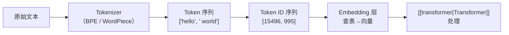

# Tokenization（分词）

> [!tip] 核心本质
> Tokenization 把文本切成模型可处理的子词 token ID——模型从未「看见」字母，只看见 tokenizer 划定的单元；分词表与切分规则决定了能表达什么、计数与拼写类任务为何会系统性失败。若没有这一步，字符串无法进入 Transformer，context 计费与多语言行为也都无从谈起。

## 生命周期与演进

**当前定位**：所有 LLM 推理链路的必经前置；BPE、WordPiece、SentencePiece 为工业标准。

**预期寿命**：长期存在；词表与多语言公平性是持续争议点。

**近期演进**：更大词表、按语言优化、与长上下文联动的 token 预算工具化。

**终极威胁**：字符级或字节级模型若算力可行，子词切分必要性下降——尚未大规模替代。

## 核心原理

### 从缺失行为逆推：如果没有 tokenization 会怎样

从零设计一个能处理文本的神经网络，你首先要解决的问题是：怎么把「字符串」变成「数字」。

最直接的方案是字符级处理——每个字母/字符对应一个 ID。问题是序列太长，「attention is O(n²)」，1000 字的英文变成 6000+ 个字符，计算量爆炸；而且模型要在字符级别学会拼写、词义、语法，几乎不可能在有限计算下完成。

另一个极端是词级处理——每个单词一个 ID。词表需要几十万条目覆盖所有变形形式，遇到新词（OOV，Out-of-Vocabulary）就直接崩溃。

Tokenization 是这两个极端之间的工程妥协：把文本切成「子词单元」（subword），既比字符长、比单词短，又能组合出未见过的词。

常见算法有三种：
- **BPE（Byte Pair Encoding）**：从字符开始，反复合并出现频率最高的相邻对，直到词表达到目标大小。GPT 系列用的是这个。
- **WordPiece**：类似 BPE，合并标准换成最大化语言模型概率，BERT 用这个。
- **SentencePiece**：直接在原始字节上操作，不依赖空格分词，多语言模型常用。

词表大小通常在 32K–100K 之间，是训练前确定的超参数，一旦固定就不能改变。

### Token 是什么样的

英文里大多数常见词就是一个 token，不常见的词会被拆开：

```
"hello"       → ["hello"]             1 token
"tokenization"→ ["token", "ization"]  2 tokens
"unbelievable"→ ["un", "believ", "able"] 3 tokens
```

中文的情况不同。BPE 训练数据中英文远多于中文，所以中文词表覆盖不充分，很多汉字会被切成字节序列（UTF-8 编码下一个汉字 3 个字节）：

```
"你好世界"  → ["你", "好", "世", "界"]    4 tokens（理想情况）
"幂等性"    → ["幂", "等", "性"]          3 tokens
"脱氧核糖核酸" → 可能被切成 10+ tokens
```

粗略换算比例：
- 英文：1 token ≈ 4 个字符 ≈ 0.75 个单词
- 中文：1 token ≈ 0.5–1 个汉字（视词频而定）
- 代码：比自然语言更节省，关键字基本是单 token

### 为什么 context window 用 token 而不是字符计

Context window 的上限是模型架构在训练时就固定的——Transformer 的位置编码、KV Cache 的维度、注意力矩阵的大小，全部以 token 为单位分配。

模型「看」到的序列是 token ID 列表，不是字符流。所以限制的天然单位就是 token 数。用字符计在技术上没有意义，因为字符转成 token 这一步在模型外部，模型本体不感知字符。

这带来一个实际后果：同样是「100 个字」的文本，中文消耗约 100–150 tokens，英文可能只消耗 30–40 tokens。在相同 context 窗口里，英文能塞进去的内容密度远高于中文。

### Tokenization 怎么影响模型行为

第一类影响：**边界切割破坏推理**。

模型做算术时频繁出错，一个重要原因是数字被切割方式不一致：

```
"1024"   → ["1024"]           整体一个 token，没有位数感知
"12345"  → ["123", "45"]      被随机拆开
"99999"  → ["999", "99"]      又是另一种拆法
```

对模型来说，「99 + 1 = 100」和「9999 + 1 = 10000」是完全不同的 token 操作，不是同一个规律。这就是为什么 LLM 做多位数加法会出错，却对简单乘法口诀记得很牢——后者在训练语料中以完整形式出现过。

第二类影响：**中文的 token 效率差异导致能力不对等**。

训练数据里英文远多于中文，中文词表覆盖率低，同等语义的中文需要更多 token 表示，参数利用效率天然偏低。这就是为什么同一个模型，用英文提问往往比用中文提问效果好，不是模型「歧视」中文，是 tokenization 造成的结构性劣势。

中文 LLM（如 Qwen、GLM）会专门扩充中文词表，把常见汉字、词组加进去，把中文 token 密度提上来，这是工程层面的补救。

第三类影响：**特殊格式的 token 化陷阱**。

Markdown、代码、URL、日期这类结构化文本，token 边界往往切在语义上没意义的地方：

```
"2024-01-15" → ["2024", "-", "01", "-", "15"]   5 tokens
"https://api.openai.com" → 拆成 8+ tokens
```

模型需要从多个 token 里重新「拼回」日期格式，这对它的理解和生成都有隐性成本。



---

## 实践与应用

**场景一：同一段话，token 数差异**

```
英文原文：
"The transformer architecture uses attention mechanisms."
→ 8 tokens

对应中文：
"Transformer 架构使用注意力机制。"
→ 约 12 tokens（中文字符 token 效率低）
```

在 128K token 的 context 里，英文文档能放进去的内容比中文多约 30%–50%。

---

**场景二：strawberry 问题复现**

```
"strawberry" → tokenizer 处理后是单个 token
模型看到的：[strawberry_token_id]
没有 s-t-r-a-w-b-e-r-r-y 的字母序列

所以模型数 "r" 的个数，等于让它数一个不透明盒子里有几个球
```

用 GPT-4o 的 tokenizer 验证：`strawberry` → `['straw', 'berry']`，两个 token，模型直接在 token 层面就丢失了字母级结构。

---

**场景三：第一性原理——如果你来设计**

假设要处理一个 1 亿词汇量的语料库，你有三个选项：

```
方案 A：字符级
  词表大小：约 200（ASCII + Unicode 常用字符）
  序列长度：原文字符数（英文 1:1，中文 1:3）
  问题：序列太长，注意力计算爆炸

方案 B：词级
  词表大小：50万+（英文词形变化就有几十万）
  OOV 问题：新词无解
  问题：词表太大，模型参数浪费在词表上

方案 C：子词（BPE）
  词表大小：50K–100K（可控）
  序列长度：介于 A 和 B 之间
  没有 OOV：任何字符串都能拆到字节级兜底
  ✓ 当前工业标准
```

BPE 能成为标准不是因为它最优雅，是因为它在「词表大小 / 序列长度 / OOV 处理」三者之间的工程权衡最实用。

---

## 常见误区

- **误区 1：token 就是单词。** 不是。「running」可能是一个 token，「tokenization」可能被拆成两个。中文里「我」和「爱」各自是 token，「爱好」也可能是一个 token——取决于词表训练结果。

- **误区 2：token 计数可以用字符数除以某个常数估算。** 只在英文纯文本里大致成立（÷4）。代码、中文、混排文本的比例差异很大，估算误差可以达到 2–3 倍。

- **误区 3：模型看不懂某个词，多加几次就行。** Token 化在进入模型前就完成了，重复出现同一个词不会改变它的 token 结构，不会帮助模型「更理解」这个词。

- **误区 4：换个语言问就是绕过了 token 限制。** 换语言可能改变 token 效率，但 context window 的 token 上限是固定的，换语言不扩容，只是换了压缩比。

- **误区 5：tokenization 错误是模型 bug，会被修复。** 不会——tokenizer 是固定的，改 tokenizer 就要重新训练模型。字母计数问题是结构性限制，不是临时 bug。

## 进一步阅读

- [Tiktokenizer（在线可视化）](https://tiktokenizer.vercel.app/) — 直接粘贴任意文本，实时看 GPT tokenizer 怎么切。理解 token 边界最直接的方式，5 分钟就能建立直觉。

- [SentencePiece 论文（Kudo & Richardson, 2018）](https://arxiv.org/abs/1808.06226) — 解释为什么要做字节级子词分词，以及多语言模型为什么不能依赖空格分词。读完能理解中文 token 效率问题的根源。

- [BPE 原始论文（Sennrich et al., 2016）](https://arxiv.org/abs/1508.07909) — BPE 用于 NLP 的出处。算法本身很简单，读原文比看二手解释清楚得多。

- [[token-prediction]] — Tokenization 决定了模型预测的「单元」是什么，理解 token prediction 才能理解为什么 token 边界会影响推理能力。

- [[context-window]] — Token 是 context window 的计量单位，两者放在一起看才能理解「为什么中文比英文更容易撑满 context」。

- [Andrej Karpathy: Let's build the GPT Tokenizer (YouTube)](https://www.youtube.com/watch?v=zduSFxRajkE) — 从零手写 BPE tokenizer，Karpathy 的教学风格是先让你感受到痛点再给解法。看完之后 token 的直觉会变得非常具体。
