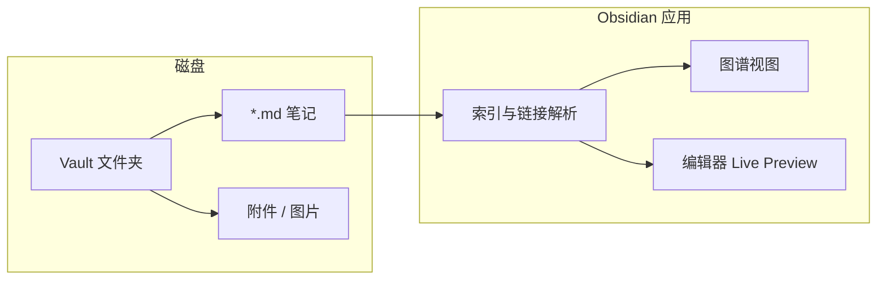
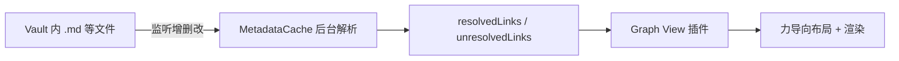
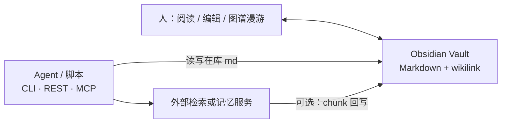

# Obsidian

> [!tip] 核心本质
> **Obsidian** 是一款**本地优先**的个人知识库应用：笔记以**纯 Markdown 文件**存在你的磁盘上，用 **wikilink**（`[[笔记名]]`）把概念连成网，用**图谱视图**看见知识结构。若没有这类「文件即数据、链接即关系」的载体，笔记只能躺在文件夹里被全文搜索或 `grep` 碰运气——人很难漫游，也很难在编辑时一眼看见「这条知识还缺哪条边」。

## 生命周期与演进

**当前定位**：成熟的 PKM 宿主（Personal Knowledge Management）。桌面端以 **Vault（库）** 为核心单位；插件生态数千级；2026 年 2 月桌面 **1.12** 起向所有用户开放官方 **CLI**，把「在应用里点选」扩展为「终端与脚本可编排」。

**预期寿命**：**本地 Markdown + 双向链接** 这一范式（long）在可预见的年内仍是个人知识库的主流之一；具体 UI、Sync 定价、CLI 子命令会随版本迭代（mid）。

**近期演进**：官方 CLI 与 **Headless Sync** 叙事（无 GUI 同步、远程备份、给 Agent 只读/受控访问库）；**Bases** 等结构化视图；Canvas 与图谱对反向链接的覆盖更完整；社区持续推动与 Cursor、Claude Code 等编码 Agent 的桥接插件。

**终极威胁**：若主流 IDE/笔记完全内置同等强度的图谱 + 本地 Git 工作流，且团队协作用例被 Notion/飞书文档统一吃掉，Obsidian 会退居「重度个人研究者」niche；对个人知识库而言，长期价值往往在于 **wikilink 约定 + 全库图谱**，而非某个闭源功能本身。

## 核心模型：Vault 与文件

Obsidian 不维护专有数据库。**一个 Vault = 你在 Obsidian 里选中的那一个顶层文件夹**（[Create a vault](https://help.obsidian.md/Getting+started/Create+a+vault)）。不是「整台电脑只能有一个根目录」，也不是「每个子文件夹各算一个 Vault」。

### Vault 边界：常见误解

| 说法 | 对不对 |
| --- | --- |
| 我选一个文件夹 → **Open folder as vault** | ✅ 这个文件夹就是 Vault 的**顶** |
| 该文件夹**里面**的任意子目录 | ✅ 仍是**同一个** Vault 里的路径，不是新 Vault |
| 每个子文件夹自动变成独立 Vault | ❌ 不会 |
| 一台机器只能有一个 Vault | ❌ 可以并存多个，各对应**不同的顶层文件夹** |
| 项目根目录「必然」等于 Vault 根 | ⚠️ **取决于你打开哪一层**：打开哪层，哪层就是 Vault 顶 |

**多库示例**：Vault A = `~/Notes/日记/`，Vault B = `~/Projects/研究笔记/`。A 里写 `[[某笔记]]` **不会**到 B 里解析；链接索引、Graph、搜索都只在**当前打开的 Vault** 内生效。

**打开层级**：若项目根目录下有 `notes/`、`assets/` 等，应打开**你希望整库联通的那一层**作为 Vault。若只打开子文件夹（例如仅 `notes/`），则 Vault 顶在该子目录，**同级或上级**的笔记与附件不在当前库内，wikilink 与 Graph 会残缺。

| 概念 | 含义 |
| --- | --- |
| **Vault** | 你指定的顶层文件夹；可多库切换 |
| **Note** | 通常一个 `.md` 文件 |
| **Attachment** | 图片、PDF 等，可放在任意子目录 |
| **`.obsidian/`** | 库级配置（插件、主题、图谱配色）；随 Vault 目录存在 |

数据归属清晰：**你拥有文件**，换编辑器只需复制文件夹。官方帮助强调可用 **Importer** 从 Notion、Evernote、Roam 等迁入（[Import notes](https://help.obsidian.md/import)）。

## 链接、图谱与 Canvas

### Wikilink

正文里写 `[[文件名]]` 或 `[[文件名|显示文字]]`，Obsidian 在**全 Vault** 内解析目标（不要求写完整路径）。带标题锚点：`[[笔记名#小节标题]]`；块引用：`[[笔记名#^block-id]]`。

**常用约定**（社区与大型库的常见做法，非 Obsidian 强制）：

- 链接尽量用**稳定、可解析**的笔记名；多目录并存时避免不同路径下重名文件，否则图谱会出现歧义节点
- 在 wikilink 里写子目录路径（如 `notes/foo` 包在双方括号内）与只写文件名，取决于「文件与链接」设置；本仓库约定全库仅用文件名（见根目录 `writing-rules.md`）

### 图谱（Graph View）

把笔记当节点、内部链接当边，交互式浏览聚类与孤岛。适合发现**只写正文、尚未链出去**的悬空笔记，或某主题是否已成团块。

**Graph 不单独存一份「图谱数据库」**：应用先在后台把 Vault 解析成**链接索引**，再由 **Graph View 核心插件**读索引画成节点与边，最后用**力导向布局**决定点在屏幕上的位置。你改笔记并保存后索引更新，图上的连线随之变化；**拖拽节点只影响当前视图布局**，不会写回 Markdown。

#### 生成流水线

| 阶段 | 做什么 |
| --- | --- |
| **索引** | 打开库或文件变更时，对每个 Markdown **异步、增量**解析 |
| **抽边** | 从正文抽出「指向谁」的链接，并尽量**解析到具体文件路径** |
| **画图** | Graph 插件**只读**索引；不再对磁盘做一遍全库 regex |

官方表述：Graph 是链接结构上的**可视化层**；反链面板 / 出链面板与 Graph 共用同一套链接数据（[Link notes](https://help.obsidian.md/Getting+started/Link+notes)）。

#### MetadataCache：链接图从哪来

应用内核维护 **MetadataCache**（插件 API：`app.metadataCache`）：

- 每个文件一份 **FileCache**：`links`、标题层级、标签、`#^block-id`、frontmatter 等
- 全库 **`resolvedLinks`**：源文件 → 已解析到的目标文件（可带出现次数）
- **`unresolvedLinks`**：正文写了 `[[某名]]` 但库里**找不到**对应笔记的链接

典型顺序：解析 wikilink / Markdown 内链 → 用文件名、路径、`aliases` 做 **`getFirstLinkpathDest` 式解析** → 全库首轮完成后触发 **`resolved`** 一类事件，此时「谁连谁」才稳定。CLI 的 `obsidian eval` 可直接读 `getFileCache(f).links`，说明 Graph 依赖的是**应用内预计算索引**，而不是每次打开 Graph 时重新扫盘。

#### 什么算节点、什么算边

**节点（默认）**：通常 **一个笔记文件** 一个点；Graph 设置里可过滤附件、Canvas、文件夹、标签等——这是**显示层**筛选，不是重建索引。

**边（默认规则）**：笔记 A 的正文里存在指向笔记 B 的**内部链接**，即一条**有向边 A → B**。常见来源：

- Wikilink：`[[笔记名]]`、`[[笔记名|显示名]]`
- 库内 Markdown 链接：`[text](笔记名.md)`（取决于「文件与链接」设置）
- 带锚点：`[[note#标题]]`、`[[note#^block-id]]`——边一般仍连到**整篇 note**；锚点主要影响跳转，通常不在 Graph 上拆成子节点
- 嵌入 `![[note]]`：通常也会计入与目标笔记的关联（具体以当前版本为准）

| 写法 | 是否默认成为 Graph 边 |
| --- | --- |
| 正文 `[[wikilink]]` | 是 |
| frontmatter 里写了 `related` 等字段，但正文无链 | **否**（除非正文也写了链，或用专门插件） |
| 正文仅文字提及某概念、未链接 | 否；可能在 Backlinks 的 **Unlinked mentions** 里 |
| 外部 URL | 否 |
| `#tag` | 不直接连两篇笔记；多用于节点**着色 / 筛选** |

**frontmatter 与 Graph**：YAML 里的 `tags`、`aliases`、`related` 便于筛选与阅读，**默认不会**自动变成 Graph 边；要在图上看见关系，正文仍需 `[[目标笔记]]` 等内部链接。

#### 布局：拓扑 vs 外形

索引只决定**拓扑**（有哪些点、谁连谁）。**屏幕坐标**由 Graph 视图在打开/刷新时计算：

- 常用 **力导向布局（force-directed）**：有边的节点相互吸引、所有节点相互排斥，迭代后形成团块与孤岛
- 同一份库、同一套链接，**团块关系可复现**；具体摆放可能因随机种子、过滤条件、你是否拖拽而略有不同

**全局 Graph** vs **局部图（Local graph）**：前者用整库 `resolvedLinks`；后者以**当前笔记**为种子，取出链 + 反链（及可配置跳数），仍是同一索引的子图。

#### 与 Canvas、外部图谱的差别

- **Canvas**（`.canvas`）：画布卡片与连线；较新版本会把 Canvas 内链接纳入反链/Graph（见 [1.12 changelog](https://obsidian.md/changelog/2026-02-27-desktop-v1.12.4)）。与正文 wikilink 互补。
- **社区 Graph 插件**：可能在核心索引之上增加「共现」「标签相似」等**额外边**——规则因插件而异。
- **外部数据库 / 自建图谱**（如 Neo4j、SQLite 节点表）：是另一套 schema，与 Obsidian 的 MetadataCache **不会自动同步**；要在 Obsidian 里可视化，仍需 Vault 内的 wikilink（或定制同步脚本）。

### Canvas

无限画布，可摆放笔记卡片、图片、箭头。适合学习路线、架构草图、非线性提纲。与 Markdown 笔记互补，不替代 wikilink 正文。

## 编辑、搜索与协作功能

| 能力 | 作用 | 边界 |
| --- | --- | --- |
| **Live Preview** | 写作时近似所见即所得，底层仍是 Markdown | 复杂公式依赖 LaTeX 或插件 |
| **全文搜索** | 跨库关键词；近年模糊搜索对空格查询有改进 | 极大库需习惯排除文件夹 |
| **反向链接 / 出链面板** | 谁链到我、我链了谁 | 依赖 wikilink，非自动抓 URL |
| **Properties（YAML frontmatter）** | `tags`、`aliases`、自定义字段 | 与正文链接分工：元数据筛选，Graph 边仍靠正文链 |
| **Obsidian Sync** | 官方端到端加密同步 | 付费；也可用 Git 等自行同步 Vault 文件夹 |
| **Obsidian Publish** | 静态站点发布笔记子集 | 公开知识花园；与私有库分工 |

## 插件生态与扩展点

核心应用刻意保持精简；**社区插件**承担垂直能力。例如 **Local REST API** 类插件可在本机暴露 HTTP 接口，供自动化或 Agent 桥接读写 Vault——需自行评估鉴权与网络暴露（仅本机、勿对公网开放）。

| 类别 | 典型用途 |
| --- | --- |
| 编辑增强 | 表格、Excalidraw、Linter |
| 检索 / AI | 语义检索、库内问答类插件 |
| 发布 / 同步 | Git、Remotely Save |
| 导入 | 官方 Importer 仓库 [obsidianmd/obsidian-importer](https://github.com/obsidianmd/obsidian-importer) |

官方提供 **Plugin API** 与主题 API（[Developer docs](https://docs.obsidian.md/)），适合把重复操作固化成插件。

## 与 Agent / 自动化工具的关系

Obsidian 本身**不是** Agent Runtime，而是**人类可读、机器也可读**的知识层：

| 集成方式 | 说明 |
| --- | --- |
| **Git** | Vault 即文件夹，版本管理与 diff 与常规代码库相同 |
| **官方 CLI（2026+）** | 应用需运行；终端可 `search`、追加内容等（[Obsidian CLI](https://obsidian.md/cli)） |
| **REST / MCP 插件** | 在运行中的 Obsidian 上下文里查索引、读笔记，避免 Agent 全库 regex 扫盘 |
| **导出** | 部分记忆类产品支持从 Obsidian 导出镜像，用于人工审计或二次入库 |

多人或多源笔记合并时，Obsidian 提供**冲突可见**的文本 diff 与链接修复面，而不是黑盒数据库——可在载体层支撑多源知识融合（见 [[knowledge-fusion]]），但合并规则仍须你自己或工具链定义。

## 业内最佳实践（个人 / 小团队知识库）

1. **一库一主题，文件名全局唯一**  
   避免不同子目录下同名 `.md`；wikilink 才能稳定解析到唯一目标。

2. **用 frontmatter 表达关系，用正文表达机制**  
   `tags` / `aliases` / 自定义字段服务筛选；**图谱连线**仍依赖正文 `[[链接]]`。

3. **版本管理用 Git 时**  
   可提交 `.obsidian/` 中的插件列表与主题；**workspace** 类个人布局缓存通常加入 `.gitignore`，避免冲突。

4. **链接优先于纯文件夹分类**  
   文件夹做粗分；跨主题关系用 wikilink 表达，Graph 才反映真实结构。

5. **自动化或 Agent 改稿后**  
   在 Obsidian 中检查孤岛节点，以及 frontmatter 声明的关系是否已有对应正文链接。

6. **启用 CLI 或 API 时默认最小权限**  
   仅本机、仅需要的 Vault；先 `search` 再定点读写，避免整库覆盖。

## 实践：开始使用

1. 安装 [Obsidian](https://obsidian.md/)（macOS / Windows / Linux；移动端另议）。
2. **Create new vault** 或 **Open folder as vault**，选中你的笔记根目录。
3. 新建一篇笔记，用 `[[另一篇笔记名]]` 建立链接；左侧打开 **Graph view** 查看连通情况。
4. 在 **Settings → Files and links** 中确认 wikilink 与新建笔记位置符合你的习惯。

## 边界与非目标

| Obsidian 擅长 | 不擅长 / 需另选 |
| --- | --- |
| 个人或小团队**本地**知识网络 | 实时多人协同编辑（更像 Notion/飞书） |
| 纯文本、可 Git diff 的长期使用 | 复杂表格数据库、审批流 |
| 可视化联想与复习 | 训练大模型、托管 Agent 运行时 |
| 插件扩展 | 开箱即用的企业合规套件 |

与 **Notion**：Notion 块模型与在线协作强；Obsidian 胜在**离线、可脚本、可移植**。与 **Roam / Logseq**：同属大纲/双链流派，Obsidian 更偏「文件夹 + Markdown 文件」心智。

## 进一步阅读

| 资料 | 说明 |
| --- | --- |
| [Obsidian 官网](https://obsidian.md/) | 产品定位、Sync / Publish |
| [Obsidian Help](https://help.obsidian.md/) | Vault、导入、快捷键 |
| [Link notes](https://help.obsidian.md/Getting+started/Link+notes) | wikilink、反链与 Graph 关系 |
| [Graph view](https://help.obsidian.md/plugins/graph) | 全局/局部图、过滤与显示 |
| [MetadataCache（Plugin API）](https://docs.obsidian.md/Reference/TypeScript+API/MetadataCache) | 索引结构、`resolvedLinks` |
| [Create a vault](https://help.obsidian.md/Getting+started/Create+a+vault) | 建库与打开已有文件夹 |
| [Obsidian CLI](https://obsidian.md/cli) | 安装、PATH、自动化场景 |
| [Changelog 1.12 Desktop](https://obsidian.md/changelog/2026-02-27-desktop-v1.12.4) | CLI 等 2026-02 变更 |
| [Importer 插件仓库](https://github.com/obsidianmd/obsidian-importer) | 从其它笔记应用迁移 |
| [Developer documentation](https://docs.obsidian.md/) | 插件与主题开发 |
