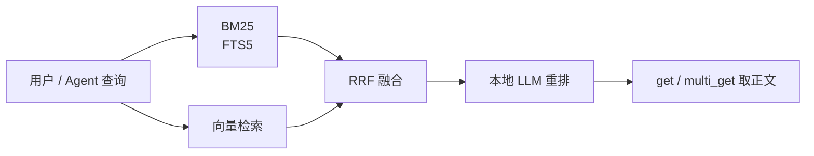

---
tags:
  - tool
  - search
  - pkm
  - markdown
aliases:
  - QMD
  - Query Markup Documents
prerequisites:
  - "[[rag]]"
related:
  - "[[obsidian]]"
  - "[[llm-wiki-overview]]"
  - "[[tool-mcp]]"
  - "[[bm25]]"
  - "[[rrf]]"
  - "[[ann]]"
  - "[[embedding]]"
  - "[[retrieval-pipeline]]"
  - "[[hyde]]"
stability: mid
layer: application
updated: 2026-06-14
---

# qmd（Query Markup Documents）

> [!tip] 核心本质
> **qmd**（[tobi/qmd](https://github.com/tobi/qmd)，npm `@tobilu/qmd`）是跑在本机的 **Markdown 混合搜索引擎**：对笔记、会议记录、文档目录建索引，用 **BM25 全文 + 向量语义 + 本地大模型重排** 召回相关文件，并提供 **CLI** 与 **[[tool-mcp|MCP]]** 供 Agent 调用。若没有这类本地检索层，[[llm-wiki-overview|LLM Wiki]] 在数百页规模下只能依赖 `index.md` 人工目录或每次 `grep`，Agent 难以在整库上做高质量「先定位、再精读」。

适合已懂 [[rag]]、用 [[obsidian]] 或纯 Markdown 仓库维护知识库、要在**隐私本地**与**Agent 可编排**之间取平衡的读者。读完 [[#2 边界：qmd 与 Obsidian 搜索、RAG、index|§2]] 能判断何时上 qmd；[[#4 实践：CLI、MCP 与 Agent|§4]] 给出最小可用命令与 MCP 接入。

*检索说明：[tobi/qmd README](https://github.com/tobi/qmd)（架构、GGUF 模型、MCP 参数；观测 2026-06-14）；Karpathy [LLM Wiki Gist](https://gist.github.com/karpathy/442a6bf555914893e9891c11519de94f) 将 qmd 列为规模化可选检索（观测 2026-06-14）。*

## 生命周期与演进

**当前定位**：个人知识库与 Agent 工作流的**可选检索后端**（mid）。由 [tobi](https://github.com/tobi) 维护；强调 **on-device**（node-llama-cpp + GGUF），索引存本地 SQLite，适合不想把整库笔记送云 embedding 的场景。

**预期寿命**：只要「本地 Markdown + Agent」范式存在，轻量混合检索就有位置；是否成为事实标准取决于 Obsidian 官方搜索、IDE 内置 RAG 与托管向量库的演进。

**近期演进**：MCP server（`query` / `get` / `multi_get` / `status`）；HTTP 传输长驻 daemon；Claude Code 插件市场安装路径；SDK `createStore()` 供 Node/Bun 嵌入。

**终极威胁**：Obsidian / Cursor 等宿主内置同等强度的本地混合检索且零配置；或用户迁到全云知识库后本地 qmd 索引维护成本显得多余。

## 1 问题语境：Wiki 变大后怎么找页

[[llm-wiki-overview]] 的经验是：约 **百级来源、数百 Markdown 页** 时，Agent 先读 `index.md` 再钻取相关页，往往够用。继续增长后，目录变长、同义词与跨页综合变难——纯关键词 `grep` 漏语义，纯向量又可能漏精确术语。

qmd 针对的是：**你已有一堆 `.md` 文件**（Wiki、Obsidian Vault、会议记录），需要在本机：

1. **建索引**（全文 + 向量，一次 `embed`）；
2. **用自然语言或关键词查**（`search` / `vsearch` / `query`）；
3. **把结果交给 Agent**（`--json`、`--files`，或 MCP）。

它不是笔记编辑器，也不是云端 RAG SaaS——是**检索运行时**，常与 [[obsidian]]（人读图、wikilink）和编码 Agent（写页、Lint）组合使用。

## 2 边界：qmd 与 Obsidian 搜索、RAG、index

**表 1 — 易混机制分工**

| 机制 | 数据在哪 | 典型场景 | 与 qmd 关系 |
| --- | --- | --- | --- |
| **`index.md` 目录** | Wiki 内人工/Agent 维护 | 中小规模 LLM Wiki | 百页内优先；大了可并存 |
| **Obsidian 内置搜索** | Vault 内 | 人点选、快速查找 | 编辑器能力；Agent 需 CLI/MCP 桥接 |
| **qmd** | 本地 SQLite 索引 | Agent 批量检索、混合排序 | 本文 |
| **企业 [[rag]]** | 向量库 + 切块服务 | 多用户、权限、实时文档 | 更重；常云端；qmd 可作个人轻量替代 |

qmd 的 pipeline 与 [[retrieval-pipeline]] 思想一致：**多路召回 → [[rrf|RRF]] 融合 → 精排**——但实现打包在单 CLI，默认用本地 GGUF 做查询扩展与重排，而非调用远程 embedding API。



## 3 核心机制

### 3.1 集合（Collection）与 context

索引按 **collection** 组织——每个 collection 指向一个目录（如 `~/notes`、`~/work/docs`）：

```bash
qmd collection add ~/notes --name notes
qmd embed   # 生成向量索引
```

**context** 是给集合的**自然语言说明**（如「个人想法与日记」「会议记录」）。匹配子文档时会一并返回，帮助 Agent 理解「这片库是什么」——README 强调这是**关键特性**，不要跳过。

文档 URI 形如 `qmd://notes/path/to/file.md`，CLI 与 MCP 输出一致。

### 3.2 三种查询命令

| 命令 | 机制 | 速度 | 质量 |
| --- | --- | --- | --- |
| `qmd search` | [[bm25]] 关键词（SQLite FTS5） | 最快 | 术语精确时好 |
| `qmd vsearch` | 向量相似度（需先 `embed`） | 中 | 自然语言问法 |
| `qmd query` | 查询扩展 + 多路 BM25/向量 + RRF + **LLM 重排** | 较慢 | **默认推荐** |

`query` 流水线（[README 架构图](https://github.com/tobi/qmd)）：原问（权重 ×2）+ 扩展问 → 并行 FTS/向量 → RRF（k=60）+ 榜首加分 → Top 30 → 本地 reranker（yes/no + logprobs）→ 按 RRF 位次混合最终分。分数约 **0.8+** 高相关、**0.2 以下** 低相关（官方区间表）。

### 3.3 本地模型与依赖

- **运行时**：Node.js ≥ 22 或 Bun ≥ 1.0；macOS 建议 `brew install sqlite`（扩展支持）。
- **默认 GGUF**（首次自动下载至 `~/.cache/qmd/models/`）：
  - `embeddinggemma-300M` — 向量（默认偏英文；可 `QMD_EMBED_MODEL` 换 Qwen 等并 `qmd embed -f` 重建）
  - `qwen3-reranker-0.6b` — 重排
  - `qmd-query-expansion-1.7B` — 查询扩展

换 embedding 模型后须 **`qmd embed -f`** 全量重建向量索引。

### 3.4 取文与批量导出

- `qmd get "path.md"` 或 `qmd get "#docid"` — 按路径或搜索结果中的 docid 取正文（支持行范围）。
- `qmd multi-get "journals/2025-*.md"` — glob 批量取。
- Agent 场景：`qmd search "…" --json -n 10`、`qmd query "…" --all --files --min-score 0.4` 列出达标文件列表。

## 4 实践：CLI、MCP 与 Agent

### 4.1 最小上手

```bash
npm install -g @tobilu/qmd
# 或 npx @tobilu/qmd

qmd collection add ~/my-wiki --name wiki
qmd context add qmd://wiki "个人 LLM Wiki 页面"
qmd embed

qmd search "项目时间线"
qmd vsearch "怎么部署"
qmd query "季度规划流程"    # 混合 + 重排，质量优先
```

### 4.2 MCP 接入

```bash
qmd mcp              # stdio，供 Claude Desktop / Cursor 等子进程拉起
qmd mcp --http       # 长驻 HTTP，默认 localhost:8181/mcp
```

暴露工具（与 [[tool-mcp]] 同层）：`query`（typed 子查询 `lex`/`vec`/`hyde`）、`get`、`multi_get`、`status`。Claude Code 可 `claude plugin install qmd@qmd`；手配则在 `mcpServers` 里 `command: qmd`, `args: ["mcp"]`。

**注意**：MCP `query` 的 `collections` 须为**字符串数组**；误写单数 `collection` 会被静默忽略，导致未按库过滤。

### 4.3 与 LLM Wiki 工作流

Karpathy [LLM Wiki](https://gist.github.com/karpathy/442a6bf555914893e9891c11519de94f) 建议：小规模靠 `index.md`；规模上来再让 Agent shell 调 qmd 或挂 MCP——**Query 阶段先检索定位 Wiki 页，再精读**，而不是每次扫全库 raw。与 [[llm-wiki-overview]] §4.1 工具链表一致。

本仓库 **AI Tell AI** 本身可作为 qmd 的 collection 路径（Vault 根目录），供 Agent 在数百 `docs/` 节点中做本地混合检索；wikilink 导航仍由人/Obsidian 图谱负责，qmd 补**语义 + 关键词**召回。

### 4.4 SDK 嵌入

`npm install @tobilu/qmd` 后可用 `createStore({ dbPath, config })` 在 Node/Bun 应用内调用 `store.search()` / `store.embed()`——须显式指定 `dbPath`，避免隐式全局副作用（README SDK 节）。

## 5 常见误区

- **qmd = Obsidian 替代品**：否；qmd 不编辑笔记，只索引与检索。编辑与图谱仍在 [[obsidian]] 或编辑器中。
- **装完就能 vsearch**：须先 `qmd embed`；换 embedding 模型须 `embed -f`。
- **query 一定比 search 快**：否；`query` 质量高但走扩展+重排，更慢；术语极明确时 `search` 即可。
- **MCP 与 CLI 行为不一致**：HTTP `/query` 与 MCP 均返回 `qmd://collection/path` URI；注意 MCP 参数命名（`collections` 数组）。
- **本地 = 零算力**：重排与扩展会吃 CPU/GPU；HTTP daemon 可复用已加载模型，空闲 5 分钟后 embedding 上下文会释放。

## 要点收束

- **qmd** = 本地 Markdown **混合检索引擎**（BM25 + 向量 + RRF + 本地 GGUF 重排）。
- **collection + context + embed** 是索引三件套；Agent 检索优先 `query`，术语检索用 `search`。
- 与 **LLM Wiki**：百页内 `index.md`；再大加 qmd CLI 或 MCP，配合 `get` 精读。
- 与 **[[rag]]**：同属召回管线思想，qmd 更轻、更本地、面向个人 `.md` 树。
- 提供 **CLI、MCP、SDK**；Claude Code 有官方插件路径。

## 进一步阅读

### 库内关联

- [[llm-wiki-overview]] — 何时从 index 升级到 qmd
- [[obsidian]] — Vault、wikilink；qmd 索引同一批 `.md`
- [[tool-mcp]] — MCP Host/Client 与 qmd `mcp` 子命令
- [[bm25]] / [[rrf]] / [[embedding]] — qmd 管线涉及的算法节点
- [[retrieval-pipeline]] — 生产 RAG 全链路；qmd 是极简本地实例

### 外部参考

- [tobi/qmd（GitHub）](https://github.com/tobi/qmd) — README、架构图、MCP 参数表
- [Karpathy — llm-wiki.md（Gist）](https://gist.github.com/karpathy/442a6bf555914893e9891c11519de94f) — Optional CLI / qmd 定位
- [npm @tobilu/qmd](https://www.npmjs.com/package/@tobilu/qmd) — 安装与版本
