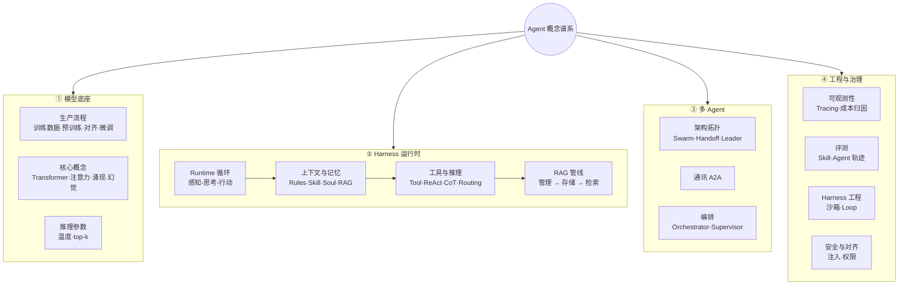

---
tags:
  - overview
  - agent
aliases:
  - Agent 概念谱系
  - Agent 概念地图
prerequisites:
  - "[[agent]]"
  - "[[llm]]"
related:
  - "[[agent]]"
  - "[[agent-paradigms]]"
  - "[[agent-context-stack]]"
  - "[[harness-engineering]]"
  - "[[multi-agent]]"
  - "[[retrieval-pipeline]]"
  - "[[memory]]"
  - "[[map]]"
stability: mid
layer: application
updated: 2026-06-17
---

# Agent 概念谱系图

> [!tip] 核心本质
> Agent 不是单独的 LLM，而是 **模型底座 + Harness 运行时 + 多 Agent 协作 + 工程治理** 四层叠合的系统。Harness 把单次生成串成可终止的多步任务；记忆、检索、工具、推理范式与意图路由都在其内调度；外部再挂编排拓扑、可观测与安全边界。

本页整合个人脑图与库内 `docs/agent/` 结构，作为 **Agent 域总览**。各分支对应 wiki 节点见 [[#分支索引|分支索引]]；细节以专文为准。

**交互星图**（科幻风 · 多形态布局）：[`tools/agent-concept-map/`](../../tools/agent-concept-map/) — `compose` 包含 / `pipeline` 流水线 / `hub` 星形；双击下钻，绑定 `docs/` 文章后随阅读点亮。`python3 -m http.server 8765` 后打开。

**图 1 — Agent 概念谱系（静态总览）**

## 读图说明

**布局**：ROOT 下四层子图**横向并列**（`ROOT --> model & harness & multi & gov`），表示并列概念域而非调用链。Harness 内 `H1 → H4` 为单 Agent 闭环能力链。全屏放大时插件会按倍率重绘以保持清晰。

**四层分工**

| 层级 | 回答什么问题 | 库内主目录 |
| --- | --- | --- |
| **模型底座** | 推理核从哪来、默认行为是什么 | `docs/model/` |
| **Harness 运行时** | 单 Agent 如何闭环执行任务 | `docs/agent/core/`、`pattern/`、`retrieval/`、`tool/`、`skill/`、`context/` |
| **多 Agent** | 多个 Agent 如何分工与传递状态 | `docs/agent/core/multi-agent.md`、`tool/a2a.md` |
| **工程与治理** | 如何观测、评测、上线、防失控 | `docs/methodology/`、`docs/model/evaluation/` |

**Harness 内部分工（与脑图对照）**

- **Runtime 循环**：感知-思考-行动闭环与错误恢复；见 [[agent]]、[[workflow]]。
- **上下文与记忆**：Rules / Skill / Soul 为静态注入；短期上下文压缩与长期 RAG/摘要见 [[agent-context-stack]]、[[memory]]。
- **工具与推理**：Tool Use、MCP 与 ReAct / CoT / Planning / Routing 相邻但分层——前者决定「能做什么」，后者决定「怎么想、走哪条路」。
- **RAG 管线**：脑图中的「知识管理 → 存储 → 粗排 → 精排」工程链路；CRAG、Modular、Graph 为可选进阶，见 [[retrieval-pipeline]]。

## 分支索引

### 模型底座 → `docs/model/`

| 脑图节点 | Wiki 节点 |
| --- | --- |
| 训练数据准备 | [[training-data]] |
| 预训练 / 对齐 / 微调 | [[local-llama-pretrain]]、[[rlhf]]、[[sft]]、[[dpo]] |
| Transformer / 注意力 | [[transformer]]、[[attention]] |
| 涌现 / 幻觉 | [[emergence]]、[[hallucination]] |
| 温度 / top k | [[llm]]（推理参数节） |

### Harness 运行时

| 脑图节点 | Wiki 节点 |
| --- | --- |
| Runtime 循环 | [[agent]]、[[workflow]]、[[harness-engineering]] |
| Rules / Skill / Soul | [[agent-context-stack]]、[[skill]] |
| 短期 / 长期记忆 | [[memory]]、[[context-compaction]] |
| Tool Use / MCP | [[tool-use]]、[[tool-mcp]]、[[function-calling]] |
| ReAct / Planning / Reflection | [[reAct]]、[[planning]]、[[reflection]]、[[agent-paradigms]] |
| CoT / ToT | [[chain-of-thought]]、[[planning]] |
| Routing / 工作流模式 | [[routing]]、[[workflow-patterns]]、[[parallelization]] |
| Query 改写 / HyDE | [[query-transformation]]、[[hyde]] |
| 触发检索 | [[triggering-retrieval]] |
| 检索管线 / 切片 / Rerank | [[retrieval-pipeline]]、[[chunking]]、[[rerank]] |
| 知识融合 / 消歧 | [[knowledge-fusion]]、[[conflict-resolution]] |
| BM25 / FTS5 / ANN | [[bm25]]、[[fts5]]、[[ann]] |
| CRAG / Modular / Graph | [[crag]]、[[modular-rag]]、[[graph-rag]] |

### 多 Agent

| 脑图节点 | Wiki 节点 |
| --- | --- |
| Swarm / Handoff / Leader | [[multi-agent]] |
| A2A | [[a2a]] |
| Orchestrator / Supervisor | [[multi-agent]]、[[agent-frameworks]] |

### 工程与治理

| 脑图节点 | Wiki 节点 |
| --- | --- |
| 可观测 / Tracing | [[agent-observability]] |
| Agent 轨迹评测 | [[agent-evaluation]]、[[llm-as-judge]] |
| Harness 工程 / Loop | [[harness-engineering]]、[[loop-engineering]] |
| 沙箱 | [[agent-sandbox]] |
| Prompt 注入 | [[prompt-injection]] |
| 框架落地 | [[langgraph]]、[[crewai]]、[[low-code-agents]] |

## 进一步阅读

- 入口与选型：[[agent]] → [[building-effective-agents]] → [[agent-paradigms]]
- 上下文与记忆：[[agent-context-stack]] → [[memory]] → [[retrieval-pipeline]]
- 多 Agent 与通讯：[[multi-agent]] → [[a2a]]
- 上线闭环：[[harness-engineering]] → [[agent-observability]] → [[agent-evaluation]]
- 全库索引：[[map]]
