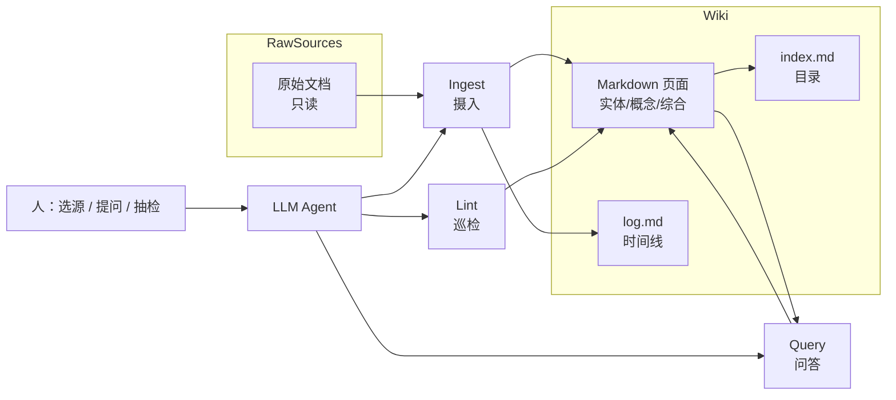

---
tags:
  - overview
  - workflow
  - knowledge-management
aliases:
  - LLM Wiki
  - Karpathy LLM Wiki
prerequisites:
  - "[[rag]]"
  - "[[context-engineering]]"
related:
  - "[[knowledge-extraction]]"
  - "[[rag]]"
  - "[[context-engineering]]"
  - "[[agent-context-stack]]"
  - "[[obsidian]]"
  - "[[qmd]]"
  - "[[memory]]"
  - "[[harness-engineering]]"
stability: mid
layer: application
updated: 2026-06-14
---

# LLM Wiki：让知识像代码一样复利增长

> [!tip] 核心本质
> LLM Wiki 是让 Agent 担任维基维护者、把资料**编译**成持久 Markdown 知识库的模式（[Karpathy Gist][karpathy-gist]）——从「每次查询重捞 raw」转为「一次摄入、持续修订、可链接综合」。若没有编译层与 Schema（模式契约）约束，对话里的洞见无法复利，[[rag]] 会话结束即消散；维护负担也会让人像弃用传统 Wiki 一样弃用知识库。

适合已懂 [[rag]]、用 Obsidian 或同类 Markdown 库、要在「上传即问」与「可浏览知识图谱」之间选路的读者。读完 [[#2 边界：Wiki、RAG 与提取层|§2]] 能判断何时上 Wiki 编译层；[[#3 三层架构与三操作|§3]] 给出可复制的 ingest / query / lint 闭环。Ingest 里「raw → 可写断言」的机制细节见 [[knowledge-extraction]]，本篇只讲工作流与 Schema。

*检索说明：模式原文 [Karpathy — llm-wiki.md Gist](https://gist.github.com/karpathy/442a6bf555914893e9891c11519de94f)、社区扩展 [LLM Wiki v2 Gist](https://gist.github.com/kanmadigital/2369c4f5ea410cb8f6a1647b40c0e2a1)（观测 2026-06-14）。*

## 生命周期与演进

**当前定位**：个人/小团队知识库范式；与 Obsidian、Claude Code/Codex、qmd 等工具链结合。原文为 **idea file**，需与 Agent 共同实例化目录与 Schema，非开箱 SaaS。

**预期寿命**：模式长期有效；v2 扩展（置信度、图谱、混合检索）随规模**可选**引入。

**近期演进**：社区 SCHEMA 模板、Hooks 自动化 Lint/Ingest、与本仓库「Agent 学习图谱 + 知识节点」思路收敛。

**终极威胁**：平台内置「永远记得一切」且可验证时，自建 Wiki 维护动机下降——可审计、可协作、可 Git 追溯的本地制品仍有价值。

## 1 问题语境：查询不复利

多数「文档 + 大语言模型」仍是 **检索增强生成（RAG）**：上传 PDF，提问时检索块并生成回答。能答，但**每次提问都在从零拼凑**——要综合五篇材料，模型得反复找片段拼接，**没有累积**（[karpathy-gist]）。NotebookLM、ChatGPT 文件上传、典型企业知识库检索与此同构：对话结束，结构化理解往往留在会话里，而非可浏览、可链接的持久资产。

LLM Wiki 把问题换成：**知识只编译一次，然后保持最新**。新来源进入时，Agent 不只建索引，而是读入、抽取要点、更新实体页与主题摘要、标注新旧矛盾，并把交叉引用与综合结论写进 Wiki 页——后续提问读的是这些**预制结构**，而不是每次从 raw 重推导。Wiki 是**可复利增长的制品**（persistent, compounding artifact）：每多一篇来源、每多一次有深度的提问，体系都更厚一点。

Karpathy 的比喻：Obsidian 是 IDE，人是产品负责人，大语言模型是程序员，Wiki 是代码库（[karpathy-gist]）。人负责**选源、提问、抽检**；Agent 负责写页、维护 `index.md` / `log.md`、跑 Ingest / Lint，并把 Query 产生的跨页综合**归档为新页面**。

## 2 边界：Wiki、RAG 与提取层

**表 1 — 易混机制分工**

| 机制 | 何时发生 | 产出物 | 复利方式 |
| --- | --- | --- | --- |
| **纯 RAG** | 每次 Query 扫 raw/向量库 | 当次回答 | 弱；洞见多在聊天历史 |
| **LLM Wiki** | Ingest/Query/Lint 写回 Markdown | 实体页、综合页、索引 | 强；页面与链接持久累积 |
| **[[knowledge-extraction\|知识提取]]** | 入库前从 raw 析候选断言 | 带溯源的候选记录 | 为融合/Wiki 写入提供契约 |
| **[[memory\|记忆]] 层** | 会话/跨会话注入 | 摘要、向量记忆 | 补上下文，不替代可浏览 Wiki |

Wiki 与 RAG **互补**：raw 仍可保留；Wiki 是人与 raw 之间的**编译层**。企业场景常见「RAG 查 raw + Agent 维护 Wiki」并存。实时行情、毫秒级事实库不适合 Wiki；**累积型**主题（研究、读书、竞品跟踪）最合适。

## 3 三层架构与三操作

### 3.1 三层架构

Karpathy 将系统分为三层（[karpathy-gist]）：

| 层级 | 角色 | 谁维护 | 典型内容 |
| --- | --- | --- | --- |
| **Raw Sources** | 原始来源 | **人选入**；对 Agent **只读** | 论文、文章、会议记录、Web Clipper 剪存的 Markdown |
| **Wiki** | 结构化知识 | **LLM 全权书写** | 实体页、概念页、对比、总览、综合论述 |
| **Schema** | 规则与流程 | **人机共演** | 页面类型、Ingest/Query/Lint 工作流、命名与 wikilink 约定 |

**Schema** 是把通用 Agent 变成「有纪律的 Wiki 维护者」的关键：没有它，模型容易只聊天、不更新文件。实践中常用 `CLAUDE.md`（Claude Code）或 `AGENTS.md`（Codex）承载，并随领域摸索修订——与 [[agent-context-stack]] 里 Rules/Schema 分工一致。

### 3.2 三操作：Ingest、Query、Lint

**图 1：** 摄入、问答与巡检如何围绕 Wiki 层闭环

**Ingest（摄入）**：新来源放入 `raw/`，Agent 阅读、写摘要页、更新索引，并**批量修订**相关实体/概念页（一篇来源常牵动十余页）。可逐篇把关，也可批量低监督——偏好写入 Schema。从 raw 到可写进 Wiki 的断言（摘录、候选、验收）遵循 [[knowledge-extraction]] 契约，本篇不展开字段级 IE。

**Query（问答）**：针对 **Wiki** 检索与综合（先读 `index.md` 定位，再深入阅读），而非每次扫原始 PDF。回答可为 Markdown、对比表、Marp 幻灯等；**有价值的回答应归档为新页面**，避免消失在聊天历史。

**Lint（巡检）**：定期审计：页间矛盾、被新证据取代的陈旧论断、孤儿页、缺专页的概念、可补的外部检索。人类弃用 Wiki 的主因是维护负担；Lint 把查矛盾、修链接、补缺页交给 Agent，人抽检关键结论（[karpathy-gist]）。

`index.md` 偏**内容目录**（按类列页与一句话摘要）；`log.md` 偏**时间线**（摄入/问答/巡检记录）。原文经验：约 **百级来源、数百页面** 时，仅靠 index 往往够用；规模再大需专用搜索（§4.2）。

### 3.3 复利机制

复利来自两条路径：**来源摄入**与**探索式问答**。一次对比分析、一条跨文档推论，若写回 Wiki，就与论文摘要一样成为后续 Query 的**预制积木**。这与 Vannevar Bush 1945 年 **Memex** 的愿景相近：珍贵的不只是文档，还有文档之间的**关联轨迹**；LLM Wiki 补上了 Bush 当时无法解决的——**谁来做维护**（[karpathy-gist]）。

## 4 实践与落地

### 4.1 典型工具链

Karpathy 参考组合（[karpathy-gist]）：

| 组件 | 选项 | 作用 |
| --- | --- | --- |
| **Agent** | Claude Code、Codex、OpenCode / Pi 等可写文件的 Agent | 执行 Ingest / Query / Lint |
| **阅读器** | [[obsidian]]（图谱、wikilink） | 人浏览 Wiki；Agent 写 Markdown |
| **剪存** | Obsidian Web Clipper 等 | 网页 → `raw/` |
| **搜索（可选）** | [[qmd]] | 本地 BM25 + 向量混合检索；CLI 或 [[tool-mcp\|MCP]] |
| **版本控制** | Git | Wiki 即仓库，变更可追溯 |

本仓库 **AI Tell AI** 是 Obsidian 知识图谱 + Agent 学习节点，与「Schema + Markdown 节点」思路相通，但范围是 **Agent 学习地图**，并非 Karpathy 原文的产品实现。

### 4.2 边界与非目标

- **规模**：百级来源内优先 `index.md` + `log.md`；再大引入混合检索与图遍历（[llm-wiki-v2]），而非无限堆页。
- **实时性**：适合累积型主题；不适合毫秒级事实库。
- **不是产品**：须与 Agent **共同实例化**目录与 Schema（[karpathy-gist]）。

### 4.3 LLM Wiki v2 扩展

社区 v1 指出：若所有论断**永远同等权重**，Wiki 会变成杂物抽屉。**LLM Wiki v2**（[llm-wiki-v2]）在保留「编译 + 维护」主线的同时，可选引入：

| 扩展 | 作用 |
| --- | --- |
| **置信度打分** | 来源数、新近度、是否被反驳；随时间衰减 |
| **取代（Supersession）** | 新证据显式取代旧主张，旧版标为过时 |
| **知识图谱** | 类型化实体与关系；Query 时沿边遍历 |
| **混合检索** | BM25 + 向量 + 图遍历；[[rrf\|RRF]] 等融合 |
| **记忆分层** | 工作/情景/语义/程序；长期未强化事实降权 |
| **自动化 Hooks** | 新来源自动摄入、会话结束归档、定时 Lint |

v2 是**模式延伸**，不否定 v1；可从三层 + 三操作起步，痛点出现再引入置信度与搜索。

### 4.4 落地要点

1. **先写 Schema，再灌资料** — 定页面类型、wikilink 规则、Ingest/Query/Lint 检查清单，避免页面丛林（[karpathy-gist]）。
2. **强制「好答案归档」** — Schema 规定：跨页综合、对比表、决策分析默认写入 Wiki 或「已探索问题」区（[karpathy-gist]；[YPOSER 实践][yposer-article]）。
3. **规模上来再换检索** — 百页内维护 index/log；再引入 [[qmd]] 或自研 BM25/向量/MCP，避免第一天搭满 RAG 却无人维护 Wiki（[karpathy-gist]、[llm-wiki-v2]）。
4. **定期 Lint + 人抽检** — 每批摄入或每周跑 Lint；团队对关键页保留人审（[karpathy-gist]）。

## 要点收束

- LLM Wiki = Agent 维护的**编译层**：raw 只读、Wiki 由 LLM 写、Schema 人机共演。
- 核心转变：从**查询时检索**到**一次编译、持续维护**；三操作 Ingest / Query / Lint 闭环。
- 与 [[rag]] **互补**；与 [[knowledge-extraction]] 分工：提取产候选，Ingest 编译成可浏览页。
- 约百级来源可靠 `index.md`；再大上混合检索与 v2 置信度/图谱。
- 原文是 idea file，须与 Agent 实例化；Obsidian + Git 是常见阅读与版本底座。

## 进一步阅读

### 库内关联

- [[rag]] — 查询时检索 vs Wiki 编译式沉淀
- [[knowledge-extraction]] — Ingest 前候选断言与溯源契约
- [[context-engineering]] — Wiki 页如何进入 Agent context
- [[agent-context-stack]] — Schema 与 Rules 分工
- [[obsidian]] — 阅读器、剪存与图谱
- [[qmd]] — 规模化后的本地混合检索
- [[memory]] — 跨会话记忆 vs 可浏览 Wiki
- [[rrf]] — v2 混合检索融合

### 外部参考

- [Karpathy — llm-wiki.md（Gist）][karpathy-gist] — 模式原文
- [LLM Wiki v2（Gist）][llm-wiki-v2] — 置信度、图谱、混合检索扩展
- [yologdev/karpathy-llm-wiki](https://github.com/yologdev/karpathy-llm-wiki) — 开源 SCHEMA 示例
- [YPOSER 产品实践][yposer-article] — Open Questions 写回 Wiki

[karpathy-gist]: https://gist.github.com/karpathy/442a6bf555914893e9891c11519de94f
[llm-wiki-v2]: https://gist.github.com/kanmadigital/2369c4f5ea410cb8f6a1647b40c0e2a1
[yposer-article]: https://ai.plainenglish.io/how-i-built-my-product-yposer-an-llm-wiki-by-adopting-andrej-karpathys-idea-71986384914c
