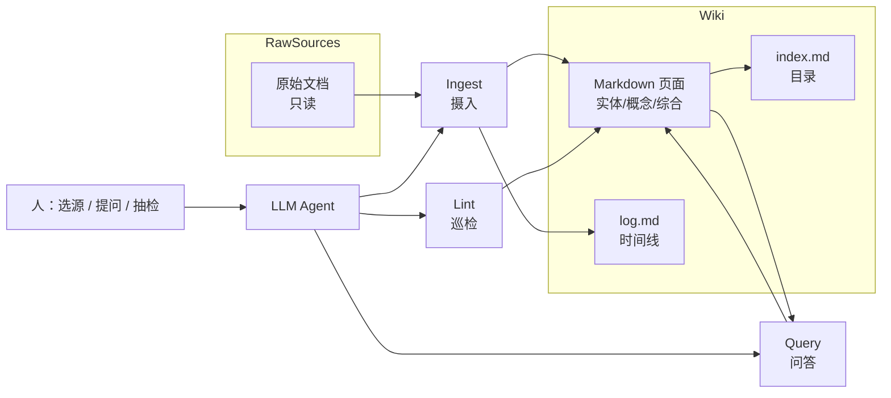

# LLM Wiki：让知识像代码一样复利增长

> [!tip] 核心本质
> LLM Wiki 是让 Agent 担任维基维护者、把资料**编译**成持久 Markdown 知识库的模式（[Karpathy Gist][karpathy-gist]）——从「每次查询重捞 raw」转为「一次摄入、持续修订、可链接综合」。若没有编译层与 Schema 约束，对话里的洞见无法复利，RAG 会话结束即消散。

## 生命周期与演进

**当前定位**：个人/小团队知识库范式；与 Obsidian、Claude Code/Codex、qmd 等工具链结合。

**预期寿命**：模式长期有效；v2 扩展（置信度、图谱、混合检索）随规模 OPTIONAL 引入。

**近期演进**：社区 SCHEMA 模板、Hooks 自动化 Lint/Ingest、与本仓库类 Agent 学习图谱思路 converging。

**终极威胁**：平台内置「永远记得一切」且可验证时，自建 Wiki 维护动机下降——可审计、可协作的本地制品仍有价值。

## 核心原理

### 问题与动机

本节说明：为什么「上传文档 + 提问」往往知识不复利，以及 LLM Wiki 把问题换成了什么。

### 1.1 摘要

- **核心转变**：从**查询时检索**（RAG）到**一次编译、持续维护**（Wiki）。
- **三层结构**：不可变的**原始来源**、LLM 维护的 **Wiki 页面**、人机共演的 **Schema**（如 `CLAUDE.md` / `AGENTS.md`）。
- **三个操作**：**Ingest**（摄入）、**Query**（问答）、**Lint**（健康检查）。
- **复利**：好答案可**归档为新页面**；探索与阅读一样让知识库变厚。
- **人机分工**：
  - **人**：决定**纳入哪些资料**（选题、可信度、放入 `raw/`）、向 Wiki **提出什么问题**、在 Schema 与关键页上**抽检/定稿**（哪些结论可以写进 Wiki、哪些只留在对话里）。
  - **LLM（Agent）**：读来源并写/改 Wiki 页、维护 `index.md` / `log.md`、跑 Ingest / Lint，在 Query 后把跨页综合**归档为新页面**。
  - 比喻（Karpathy）：Obsidian 是 IDE，人是产品负责人，LLM 是程序员，Wiki 是代码库 [karpathy-gist]。

### 1.2 现有方案的局限

多数「文档 + LLM」体验仍是 **RAG**：上传 PDF、文章或笔记，提问时检索相关块并生成回答。能答，但**每次提问都在从零拼凑**——需要综合五篇材料时，模型要反复找到并拼接片段，**没有累积**（[详见][karpathy-gist]）。NotebookLM、ChatGPT 文件上传与典型企业知识库检索，在模式上与此相近：对话结束，结构化理解往往留在会话里，而非变成可浏览、可链接的持久资产。

### 1.3 编译而非检索

LLM Wiki 的洞见是：**知识只编译一次，然后保持最新**，而不是每次查询重新推导（[详见][karpathy-gist]）。加入新来源时，LLM 不只建索引，而是**读入、抽取要点、更新实体页与主题摘要、标注新旧矛盾**，并把**交叉引用与综合结论写进 Wiki 页面**——后续提问读的是这些预制结构，而不是每次从 raw 重新拼凑。Wiki 是**可复利增长的制品**（persistent, compounding artifact）：每多一篇来源、每多一次有深度的提问，体系都更厚一点。由此自然引出下一节的三层架构与三个操作。

### 架构与机制

本节拆解 LLM Wiki 的静态结构与动态工作流：资料如何分层、日常如何运转。

### 2.1 三层架构

Karpathy 将系统分为三层（[详见][karpathy-gist]）：

| 层级 | 角色 | 谁维护 | 典型内容 |
| --- | --- | --- | --- |
| **Raw Sources** | 原始来源 | **人选入并归档**；文件对 Agent **只读** | 论文、文章、会议记录、从网页剪存下来的 Markdown |
| **Wiki** | 结构化知识 | **LLM 全权书写** | 实体页、概念页、对比、总览、综合论述 |
| **Schema** | 规则与流程 | **人机共演** | 页面类型、摄入/问答/巡检工作流、命名与链接约定 |

**Schema** 是把通用 Agent 变成「有纪律的 Wiki 维护者」的关键：没有它，模型容易只聊天、不更新文件。实践中常用 `CLAUDE.md`（Claude Code）或 `AGENTS.md`（Codex）承载 Schema，并随领域摸索逐步修订。

### 2.2 三个核心操作

**图 1：** LLM Wiki 中摄入、问答与巡检如何围绕 Wiki 层闭环

1. **Ingest（摄入）**：将新来源放入 `raw/`，由 Agent 阅读、写摘要页、更新索引，并**批量修订**相关实体/概念页（一篇来源常牵动十余页）。可逐篇人工把关，也可批量低监督——由 Schema 记录你的偏好。读 raw 后**要点如何变成可写进 Wiki 的断言**（摘录、候选记录、验收再写入）见 [[knowledge-extraction|知识提取]]，本篇不展开 IE 契约细节。
2. **Query（问答）**：针对 **Wiki** 检索与综合（先读 `index.md` 定位页面，再深入阅读），而非每次扫原始 PDF。回答可呈现为 Markdown、对比表、幻灯（Marp）等；**有价值的回答应归档为新页面**，避免消失在聊天历史里。
3. **Lint（巡检）**：定期让 Agent 审计：页面间矛盾、已被新证据取代的陈旧论断、无入链的孤儿页、被提及却缺专页的概念、可补的外部检索等。维护负担本是人类弃用 Wiki 的主因；把 Lint 交给 Agent 后，**查矛盾、修链接、补缺页等例行维护主要由机器完成**，人只需抽检关键结论（[详见][karpathy-gist]）。

导航上，`index.md` 偏**内容目录**（按类列出页面与一句话摘要），`log.md` 偏**时间线**（摄入/问答/巡检记录）。中等规模（约百篇来源、数百页面）时，仅靠索引往往够用；规模再大则需专用搜索（见下文）。

### 2.3 复利机制

复利来自两条路径：**来源摄入**与**探索式问答**。一次对比分析、一条跨文档推论，若写回 Wiki，就与论文摘要一样成为后续 Query 的**预制积木**。这与 Vannevar Bush 1945 年 **Memex** 的愿景相近：珍贵的不只是文档，还有文档之间的**关联轨迹**；LLM Wiki 补上了 Bush 当时无法解决的——**谁来做维护**（[详见][karpathy-gist]）。

## 实践与应用

本节讨论如何落地、何时不适用，以及社区在 v1 模式上的扩展。

### 3.1 典型工具链

Karpathy 的参考组合（[详见][karpathy-gist]）：

- **Agent**：Claude Code、Codex、OpenCode / Pi 等可编辑文件的 LLM Agent。
- **阅读器**：Obsidian（图谱、wikilink、本地 Markdown）。
- **网页剪存（Web Clipper）**：Obsidian Web Clipper 等浏览器扩展将网页转为 Markdown 存入 `raw/`。
- **搜索（可选）**：[qmd](https://github.com/tobi/qmd) 等对 Wiki 做本地 **BM25 + 向量** 混合检索，提供 CLI 或 MCP。
- **版本控制**：Wiki 即 Git 仓库，变更可追溯、可协作。

本仓库 **AI Tell AI** 本身是 Obsidian 知识图谱 + Agent 学习节点，与 LLM Wiki 的「Schema + Markdown 节点」思路相通，但品牌与范围是 **Agent 学习地图**，并非 Karpathy 原文的产品实现。

### 3.2 边界与非目标

- **规模**：原文经验在约 **百级来源、数百页面** 时，`index.md` 仍好用；再大需混合检索与图谱遍历，而非无限堆页面（[详见][llm-wiki-v2]）。
- **实时性**：Wiki 适合**累积型**主题（研究、读书、竞品跟踪）；不适合毫秒级事实库。
- **与 RAG 的关系**：**互补**。原始来源仍可保留；Wiki 是介于人与 raw 之间的**编译层**。企业场景也可「RAG 查 raw + Agent 维护 Wiki」并存。
- **不是产品**：原文是 **idea file**，需与你的 Agent **共同实例化**目录结构与 Schema，而非开箱即用 SaaS（[详见][karpathy-gist]）。

### 3.3 LLM Wiki v2 的演进

社区在 v1 模式上指出：若所有论断**永远同等权重**，Wiki 会变成「杂物抽屉」。**LLM Wiki v2**（[详见][llm-wiki-v2]）在保留「编译 + 维护」主线的同时，补充：

- **置信度打分**：事实带来源数、新近度、是否被反驳；随时间衰减，强化可重复验证的陈述。
- **取代（Supersession）**：新证据**显式取代**旧主张，旧版保留但标为过时。
- **知识图谱**： typed 实体与关系，Query 时可**沿边遍历**（如「升级 Redis 影响哪些下游」），补关键词搜不到的结构性关联。
- **混合检索**：BM25 + 向量 + 图遍历，用 **RRF** 等融合多路结果。
- **记忆分层与遗忘曲线**：工作/情景/语义/程序记忆；长期未 reinforcement 的事实**降权**而非硬删。
- **自动化 Hooks**：新来源自动摄入、会话结束压缩归档、定时 Lint——减少「记得更新 Wiki」的意志力消耗。

v2 是**模式延伸**，不否定 v1；小 Wiki 可从三层 + 三操作起步，再在痛点出现时引入置信度与搜索。

### 3.4 业内最佳实践

以下三条均可在小团队或个人环境落地，并对应可追溯来源。

1. **先写 Schema，再灌资料**  
   在摄入大量 PDF 之前，用 Agent 与你一起定好：页面类型（实体/概念/来源摘要）、wikilink 规则、Ingest/Query/Lint 的检查清单。否则模型易生成无法维护的页面丛林。依据：Karpathy 强调 Schema 是「有纪律的维护者」之关键（[karpathy-gist]）。

2. **强制「好答案归档」**  
   在 Schema 中规定：凡产生跨页综合、对比表或决策分析的 Query，默认追加为 Wiki 新页或写入相关页的「已探索问题」区。这样探索与阅读一样复利。依据：原文 Query 节（[karpathy-gist]）；YPOSER 等实现将 gap 写回 Open Questions（[yposer-article]）。

3. **规模上来再换检索，别过早工程化**  
   百页以内优先维护好 `index.md` + `log.md`；超过后再引入 qmd 或自研 BM25/向量/MCP，避免第一天就搭完整 RAG 栈却无人维护 Wiki。依据：原文 **Indexing and logging** 与 Optional CLI（[karpathy-gist]）；v2 混合检索（[llm-wiki-v2]）。

4. **定期 Lint，并让人抽检**  
   每周或每批摄入后运行 Lint：矛盾、孤儿页、缺页概念。团队场景可对关键页保留人审再合并。依据：Lint 操作定义（[karpathy-gist]）；Synthadoc 等项目的对抗式审阅延伸（见延伸阅读）。

## 进一步阅读

- [[rag]] — 查询时检索 vs Wiki 编译式沉淀
- [[context-engineering]] — Wiki 页如何进入 Agent context
- [[agent-context-stack]] — Schema 与 Rules 分工
- [Karpathy — llm-wiki.md（Gist）][karpathy-gist] — 模式原文
- [LLM Wiki v2（Gist）][llm-wiki-v2] — 置信度、图谱、混合检索扩展
- [yologdev/karpathy-llm-wiki](https://github.com/yologdev/karpathy-llm-wiki) — 开源 SCHEMA 示例
- [AI Builder Club — Karpathy's LLM Wiki](https://www.aibuilderclub.com/blog/karpathy-llm-wiki) — 英文入门
- [qmd](https://github.com/tobi/qmd) — 本地混合检索后端
- [YPOSER 产品实践][yposer-article] — Open Questions 写回 Wiki

[karpathy-gist]: https://gist.github.com/karpathy/442a6bf555914893e9891c11519de94f
[llm-wiki-v2]: https://gist.github.com/kanmadigital/2369c4f5ea410cb8f6a1647b40c0e2a1
[yposer-article]: https://ai.plainenglish.io/how-i-built-my-product-yposer-an-llm-wiki-by-adopting-andrej-karpathys-idea-71986384914c
